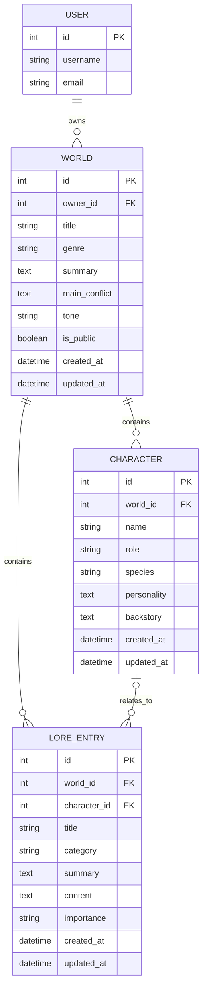

# Lorekeeper

## Live Site

Live site link will be added after deployment.

## Repository

Repository link will be added here.

---

## Table of Contents

- [Project Overview](#project-overview)
- [Purpose and Value](#purpose-and-value)
- [Target Audience](#target-audience)
- [User Experience](#user-experience)
- [Agile Methodology](#agile-methodology)
- [Features](#features)
- [Database Schema](#database-schema)
- [Design and Styling](#design-and-styling)
- [JavaScript Features](#javascript-features)
- [Technologies Used](#technologies-used)
- [Testing](#testing)
- [Bugs and Fixes](#bugs-and-fixes)
- [Deployment](#deployment)
- [Security](#security)
- [Future Features](#future-features)
- [Credits](#credits)
- [Acknowledgements](#acknowledgements)

---

## Project Overview

Lorekeeper is a full-stack Django web application designed for writers, roleplayers, tabletop game masters and creative hobbysists who want a structured place to create, organise and optionally share fictional worlds with others.

The application allows registered users to create fictional worlds and attach related worldbuilding records such as characters and lore entries. Users can choose whether each world is public or private. Public worlds can be browsed through a public world library, while private worlds remain visible only to their owner.

---

## Purpose and Value

Worldbuilding notes often become scattered across notebooks, documents, message threads, spreadsheets or disconnected files. Lorekeeper solves this by giving users one organised placed to store the core parts of a fictional setting with a visually appealling theme to seperate text-heavy lore into something more interactive. It has collapsible elements to easily keep track of details within each world.

The application provides value by allowing users to:

- Create structured fictional worlds.
- Attach characters and lore entries to specific worlds.
- Keep private worldbuilding notes secure.
- Share selected worlds publicly for inspiration.
- Search and filter public worlds.
- Manage their own creative records through a private dashboard.

The goal is to keep the app simple, beginner-friendly and useful without becoming a large or complicated writing platform.

---

## Target Audience

| User Group | Need |
|---|---|
| Writers | Store fictional settings, character notes and lore in one organised place. |
| Roleplayers | Manage original worlds, characters and background lore. |
| Tabletop game masters | Keep lightweight campaign/world notes without needing a complex system. |
| Creative hobbyists | Structure creative ideas in a simple web app. |
| Browsing users | View public worlds for inspiration. |

---

## User Experience

### Website Owner Goals

The website owner wnats to provide a free and accessible worldbuilding organiser that:

- stores structured worldbuilding data.
- supports user accounts and ownership.
- allows public/private world visibility.
- encourages users to explore public worlds.
- uses an interface that feels creative and relevant to worldbuilding.
- allows for future features to be easily integrated within the website.

### User Goals

Users should be able to:

- understand what Lorekeeper is from the homepage.
- register, log in and log out.
- create, view, edit and delete their own worlds, characters linked to worlds, and lore entries.
- optionally link lore entries to characters.
- mark worlds as public or private.
- browse public worlds.
- search and filter public worlds.
- get clear feedback after actions.
- avoid accidentally deleting records through confirmation pages. 

### Design Goals

Lorekeeper uses a **cosmic multiverse archive** theme. This was chosen so the app feels like a fictional worldbuilding library rather than a plain database interface. It gives the illusion of everyone's worlds existing within one multiverse archive.

The design focuses on:

- dark cosmic colours.
- blue, purple, pink and cyan highlights.
- glass-style panels.
- card-based layouts.
- clear buttons and badges.
- responsive layouts.
- accessible contrast and focus states.
- gentle decorative animation with reduced-motiion support.

---

## Agile Methodology

This project uses GitHub Issues and GitHub Project Board as a product backlog.

### Project Board

The board uses the following workflow columns:


### Prioritisation 

MoSCoW prioritisation is used:

### Story Points

Story points were used to estimate the issue size, as seen here:

### Completed Issues

Here you can see some completed issues including Must Have's and some Could Have's:

### Won't Have Scope Control

The following features were intentionally excluded from the MVP to avoid scope creep:

- image uploads.
- AI generation.
- collaborative editing.
- private messaging.
- rich text editor.
- complex maps or timelines.
- full TTRPG rules/stat system.

These may be included as future features, but for now have been listed as Won't Have's.

---

## Features

### Existing Features

#### Homepage

The homepage introduces Lorekeeper and explains that it can be used to create, organise and share fictional worlds.

Homepage picture: 

#### About Page

The About page explains the purpose of Lorekeeper, the intended audience and how the application supports creative worldbuilding.

About Page Picture:

#### Public World Library

The Public World Library displays only worlds marked as public. It is accessible to logged-in and logged-out users.

Each public world card includes key information such as:

- title.
- genre.
- creator username.
- summary.
- public status.
- link to view the world.

Private worlds do not appear in the library.

Public world library picture:

#### Create World Page

The create world page allows users to create their own world and decide if they want it public or private. The form has validation to ensure required fields are filled in.

Create World Page picture:

#### Create Character/Lore Entry Pages

Much like the create world page, the create character and create lore entry pages allow users to fill out forms and link them to worlds/characters where necessary. These forms also have validation for required fields.

Create Character Page Picture:

Create Lore Entry Page Picture:

#### User Registration

Users can register for an account using Django's built-in 'UserCreationForm'. After successful registration, the user is automatically logged in and shown a success message.

Picture User Registration:

#### Login and Logout

Users can log in using Django's authentication system and log out using a custom logout view that displays a success message.

Pictures:

#### Dashboard

The dashboard allows users to see all of their created worlds, whether public or private. This is where they can edit and update their worlds, delete them, or make them private/public if needed.

The dashboard includes:

- total world count.
- per-world character count.
- per-world lore entry count.
- public/private status badges.
- links to view details.
- create world link.
- empty state when no worlds exist.

Dashboard Page picture:

#### Dashboard Counters

Dashboard counters give users quick feedback about their content.

The dashboard shows:

- total number of worlds ownbed by the logged in user.
- character count for each world.
- lore entry count for each world.

The count updates when related records are added or deleted.

Picture of dashboard counters:

#### World CRUD

Logged-in users can create, view, update and delete their own worlds. 

World records include:

- title.
- genre.
- summary.
- main conflict.
- tone.
- public/private status.
- created date.
- updated date.

The owner is assigned automatically from the logged-in user and is not exposed as a form field. 

Create world picture:
World detail picture:
edit world picture:
delete world picture:

#### Character CRUD

Users can create characters linked to worlds they own. Characters are managed through their parent world.

Character records include:

- name.
- role.
- species.
- personality.
- backstory.
- created date.
- updated date.

Characters appear on their related world detail page and can be opened on their own detail page.

Character list picture:

character detail picture:

character form picture:

#### Lore Entry CRUD

Users can create lore entries linked to worlds they own. Lore entries can optionally be linked to a character from the same world.

Lore entry records include:

- title.
- category.
- summary.
- full content.
- importance.
- optional related character.
- created date.
- updated date.

THe related character dropdown is filtered to characters from the current world only. This prevents users from linking a lore entry to a character from another world.

Lore entry list picture:

Lore entry detail picture:

Lore entry form picture:

#### Form Validation Feedback

Required fields use browser validation first, which prevents users from submitting blank requried fields. A Django/server-side error summary block was also added to the form templates as a fallback if invalid form data reaches the server.

Validation feedaback was added to:

- World form.
- Character form.
- Lore Entry Form.

#### Delete Confirmation Page

Worlds, characters and lore entries all have confirmation pages before deletion. This helps prevent accidental data loss.

picture of delete confirmation pages:

#### Public and Private Worlds

Each world can be marked as public or private.

| User Type | Public World | Private World |
|---|---|---|
| Owner | Can view and manage | Can view and manage |
| Logged-in non-owner | Can view only | Blocked / 404 |
| Logged-out visitor | Can view only | Blocked / 404 |

Owner-only links such as edit, delete, add character and add lore entry are hidden from non-owners.

public world logged out picture:

private world 404:

#### Public World Search

Users can search public worlds by:

- world title.
- partial title.
- summary.
- genre.
- tone.
- related character name.
- related character role.
- related character species.
- related lore entry title.
- related lore entry summary.
- related lore entry content.
- related lore entry category.

The search uses Django 'Q' objects and '.distinct()' to prevent duplicate worlds from appearing when multiple related records match the same query.

Public world search picture:
Search results picture:

### Genre Filter

The Public World Library includes a genre filter. Users can filter by genre and combine the filter with a search query.

A clear/reset link appears when a search or filter is active.

Genre filter picture: 

Combined search and filter picture:


#### Responsive Navigation

The website uses a shared 'base.html' template with consistent navigation. Navigation changes depending on authentication status.

Logged-out users can see:

- Home
- About
- Public Worlds
- Register
- Login

Logged-in users can see:

- Home
- About
- Public Worlds
- Dashboard
- Create World
- Logout

Picture of logged in:

Picture of logged out:

---

## User Stories

User stories are currently managed through GitHub Issues and the Lorekeeper Product Backlog project board.

A full list of user stories will be documented here as development progresses.

---

## Database Schema

Lorekeeper uses a relational database structure designed around worldbuilding content. The main prupose of the database is to allow registered useres to create fictional worlds and organise related records such as characters and lore entries.

The implemented schema contains the following main models:

- Django's built-in 'User' model.
- 'World'.
- 'Character'.
- 'LoreEntry'.

Django's built-in 'User' model is used for authentication and ownership. The custom models are stored in the 'worlds' app.

## Entity Relationship Diagram



### Model Relationships

#### User to World

Each 'World' belongs to one registered user through the 'owner' field.

```python
owner = models.ForeignKey(
    settings.AUTH_USER_MODEL,
    on_delete=models.CASCADE,
    related_name='worlds'
)
```

This create a one-to-many relationship:

```text
User 1 ---- many Worlds
```

A single user can create many worlds, but each world belong to one user. If a user account is deleted, their worlds are also deleted because 'on_delete=models.CASCADE' is used.

This relationship supports ownership protection because users can only edit and delte worlds that belong to them.

#### World to Character

Each 'Character' belogns to one 'World'.

```python
world = models.ForeignKey(
    World,
    on_delete=models.CASCADE,
    related_name='characters'
)
```

This creates a one-to-many relationship:

This creates a one-to-many relationship:

```text
World 1 ---- many Characters
```

If a world is deleted, its related characters are also deleted. The 'related_name='characters'' allows characters to be accessed from a world using:

```python
world.characters.all()
```

#### World to LoreEntry

Each 'LoreEntry' belongs to one 'World'.

```python
world = models.ForeignKey(
    World,
    on_delete=models.CASCADE,
    related_name='lore_entries'
)
```

This creates a one-to-many relationship:

```text
World 1 ---- many Lore Entries
```

If a world is deleted, its related lore entries are also deleted. The 'related_name='lore_entries'' allows lore entries to be accessed from a world using:

```python
world.lore_entries.all()
```

#### Character to LoreEntry

A 'LoreEntry' can optionally be linked to a 'Character'.

```python
character = models.ForeignKey(
    Character,
    on_delete=models.SET_NULL,
    related_name='lore_entries',
    blank=True,
    null=True
)
```

This creates an optional relationship:

```text
Character 0/1 ---- many Lore Entries
```

A lore entry does not have to be connected to a character. This is useful because some lore entries are world-level information, such as history, culture, magic systems, politics, geography or timelines.

If a related character is deleted, the lore entry is not deleted. Instead, the 'character' field is set to 'NULL' because 'on_delete=models.SET_NULL' is used. This protects lore records from being accidentally removed when a character is deleted.

### Model Details

#### World Model

The 'World' model is the main container for fictional settings in Lorekeeper.

| Field | Type | Purpose |
|---|---|---|
| `owner` | ForeignKey | Links the world to the user who created it |
| `title` | CharField | Stores the name of the fictional world |
| `genre` | CharField with choices | Stores the world's genre |
| `summary` | TextField | Stores a summary of the world |
| `main_conflict` | TextField | Optional field for the central conflict, war, mystery or tension |
| `tone` | CharField | Optional field for the tone or mood of the world |
| `is_public` | BooleanField | Controls whether the world appears publicly |
| `created_at` | DateTimeField | Automatically stores when the world was created |
| `updated_at` | DateTimeField | Automatically stores when the world was last updated |

The 'World' model uses predefined genre choices to keep data consistent:

```python
GENRE_CHOICES = [
    ('fantasy', 'Fantasy'),
    ('sci_fi', 'Science Fiction'),
    ('horror', 'Horror'),
    ('modern', 'Modern'),
    ('historical', 'Historical'),
    ('supernatural', 'Supernatural'),
    ('other', 'Other'),
]
```

World records are ordered by newest first:

```python
class Meta:
    ordering = ['-created_at']
```

#### Character Model

The 'Character' model stores character profiles attached to a fictional world.

| Field | Type | Purpose |
|---|---|---|
| `world` | ForeignKey | Links the character to a specific world |
| `name` | CharField | Stores the character's name |
| `role` | CharField | Optional field for the character's role |
| `species` | CharField | Optional field for the character's species or type |
| `personality` | TextField | Optional field for personality details |
| `backstory` | TextField | Optional field for character history or background |
| `created_at` | DateTimeField | Automatically stores when the character was created |
| `updated_at` | DateTimeField | Automatically stores when the character was last updated |

Character records are ordered alphabetically by name:

```python
class Meta:
    ordering = ['name']
```

#### LoreEntry Model

The 'LoreEntry' model stores structured worldbuilding information attached to a world.

| Field | Type | Purpose |
|---|---|---|
| `world` | ForeignKey | Links the lore entry to a specific world |
| `character` | ForeignKey | Optionally links the lore entry to a character |
| `title` | CharField | Stores the lore entry title |
| `category` | CharField with choices | Stores the type/category of lore |
| `summary` | TextField | Optional short overview of the lore entry |
| `content` | TextField | Stores the full lore entry |
| `importance` | CharField with choices | Stores the importance level of the lore entry |
| `created_at` | DateTimeField | Automatically stores when the lore entry was created |
| `updated_at` | DateTimeField | Automatically stores when the lore entry was last updated |

The `LoreEntry` model uses category choices to keep lore organised:

```python
CATEGORY_CHOICES = [
    ('history', 'History'),
    ('culture', 'Culture'),
    ('magic', 'Magic'),
    ('technology', 'Technology'),
    ('politics', 'Politics'),
    ('religion', 'Religion'),
    ('species', 'Species'),
    ('timeline', 'Timeline'),
    ('geography', 'Geography'),
    ('miscellaneous', 'Miscellaneous'),
]
```

It also uses importance choices:

```python
IMPORTANCE_CHOICES = [
    ('low', 'Low'),
    ('medium', 'Medium'),
    ('high', 'High'),
    ('essential', 'Essential'),
]
```

Lore entries are ordered alphabetically by title:

```python
class Meta:
    ordering = ['title']
```

### Why This Schema Fits the Project

This schema fits Lorekeeper because the application is designed around organising ficitonal worldbuilding content.

The structure follows the natural hierarchy of the domain:

```text
A user owns worlds.
A world contains characters.
a world contains lore entries.
A lore entry may optionally relate to a character.
```

This allows useres to build structured fictional settings without storing all information in one large, unorganised table.

This schema also supports privacy and ownership because worlds are linked to users. This allows the app to check whether the current user owns a world before allowing edit or delete actions.

---

## Design and Styling

### Visual Theme

Lorekeeper uses a custom **cosmic multiverse archive** visual theme. The theme was chosen to support the purpose of the application as a fictional worldbuilding organiser.

The styling uses:

- dark cosmic background colours;
- blues, purples, pinks and cyan highlights;
- starfield / nebula-inspired gradients;
- rounded glass-style panels;
- card-based layouts;
- soft glow effects;
- hover effects on cards, links and buttons;
- consistent form styling;
- clear public/private badges;
- responsive layouts for smaller screens. 

### Static Files

The main custom stylesheet is stored at:

```text
worlds/static/worlds/css/style.css
```

It is linked in `base.html` using:

```django

<link rel="stylesheet" href="">
```

### Fonts

Google Fonts are loaded in 'base.html'.

```html
<link href="https://fonts.googleapis.com/css2?family=Lexend:wght@300;400;500;600;700&family=Roboto:wght@300;400;500;700&display=swap" rel="stylesheet">
```

The main font stack is:

```css
--font-main: "Lexend", "Roboto", Arial, sans-serif;
```

These fonts have been chosen to be dyslexia/visual stress-friendly.

### Animated Background

Lorekeeper uses a custom animated background to support the visual theme of the application. Since the app is designed as a fictional worldbuilding archive, the interface was intended to feel like a cosmic library or multiverse map rather than a plain database application.

The background was created using CSS only. It uses a combination of:

- 'linear-gradient()'
- 'radial-gradient()'
- 'body::before'
- 'body::after'
- '@keyframes' animation.

The main body background uses several layered CSS gradients. The 'linear-gradient()' creates the base colour blend across the page, while the 'radial-gradient()' layers create softer glowing areas that look like nebula clouds.

The 'body::before' pseudo-element creates an extra decorative nebula layer. It is fixed to the viewport, blurred with 'filter: blur()' and animated slowly using the 'nebulaDrift' keyframes.

The 'body::after' pseudo-element creates the starfield effect. It uses several small 'radial-gradient()' layers, each with different 'background-size' values. This creates the appearance of stars at different positions and sizes. The 'starFloat' keyframes animate the 'background-position', which makes the stars move slowly across the page.

Both pseudo-elements use 'pointer-events: none;' so they do not interfere with clicking links, buttons or forms. They also use negative 'z-index' values so they sit behind the main page content.

### Reduced Motion Accessibility

The animated background is decorative only and does not affect the functionality of the website. To support accessibility, a 'prefers-reduced-motion' media query is included. This reduces animation and transition effects for users who have selected reduced motion in their system settings.

```css
@media (prefers-reduced-motion: reduce) {
    *,
    *::before,
    *::after {
        animation-duration: 0.001ms !important;
        animation-iteration-count: 1 !important;
        scroll-behavior: auto !important;
        transition-duration: 0.001ms !important;
    }
}
```

### Responsive Design

Media queries were added for:

```css
@media (max-width: 880px)
@media (max-width: 640px)
```

Responsive changes include:

- navigation stacking/wrapping;
- home hero layout stacking;
- search form stacking;
- footer stacking;
- full-width mobile buttons;
- responsive card grids;
- adjusted padding and border radius;
- badge stacking on smaller screens.

### Accessibility Considerations

Accessibility considerations include:

- semantic HTML where possible;
- form labels generated through Django forms;
- visible focus states;
- readable colour contrast;
- browser validation for required fields;
- server-side validation fallback;
- accessible `aria-expanded` attributes on collapsible JavaScript buttons;
- reduced-motion support for decorative animation;
- content remaining visible by default if JavaScript does not run.

---

## JavaScript Features

Custom JavaScript is stored at:

```text
worlds/static/worlds/js/script.js
```

It is linked in 'base.html' with 'defer', so it loads after the HTML has been parsed:

```django
<script src="" defer></script>
```

The JavaScript is used for frontend enhancement only. Core data handling, validation and permissions are still managed by Django on the back end.


### Collapsible Detail Sections

Collapsible sections were added to:

- world detail pages;
- character detail pages;
- lore entry detail pages.

Users can expand and collapse longer content sections such as world details, characters, lore entries, character backstory, full lore entry content and record information.

This improves usability because large worldbuilding records can be browsed more easily without overwhelming the user.

The implementation uses:

- buttons with the class '.collapsible-toggle';
- 'data-target' attributes to identify the section to show/hide;
- 'aria-expanded' attributes for accessibility;
- a '.collapsed-section' CSS class to hide content.

Content is visible by default, so the page still works if JavaScript fails to load.

### Live World Form Preview

A live preview card was added to the create/edit world form.

As the user fills in the world form, JavaScript updates a preview card with:

- world title
- genre
- public/private status
- summary
- main conflict
- tone

This gives immediate feedback while the user creates or edits the main parent record in the application.

The live preview was limited to the World form because worlds are the central container record in Lorekeeper. Character and lore entry forms were not given live previews at this stage to keep the JavaScript focused and avoid unnecessary complexity before deployment.

### JavaScript Testing Notes

The browser console was checked after implementing JavaScript interactions. No JavaScript errors appeared, and the collapsible sections/live preview continued to work as expected.

JavaScript No Errors picture:

## Technologies Used

| Technology | Purpose |
|---|---|
| HTML | Structure of Django templates. |
| CSS | Custom styling, layout, responsive design and animation. |
| JavaScript | Frontend interactivity including collapsible sections and live preview. |
| Python | Back-end programming language. |
| Django | Main web framework for models, views, forms, templates, authentication and routing. |
| SQLite | Local development database. |
| PostgreSQL | Planned production database for deployment. |
| Git | Version control. |
| GitHub | Remote repository, issues and project board. |
| Heroku | Planned deployment platform. |
| Google Fonts | Lexend and Roboto fonts. |
| Mermaid | ERD diagram in README. |

---

## Testing 

Testing was carried out manually throughout development. Testing focused on:

- page loading
- navigation
- authentication
- CRUD functionality
- database relationships
- permissions and ownership
- public/private visibility
- search and filters
- validation feedback
- responsive layout
- JavaScript interactions
- browser console errors
- bug fixes

### Authentication Testing

| Test ID | Feature | Test Action | Expected Result | Actual Result | Status |
|---|---|---|---|---|---|
| AUTH-01 | Register | Navigate to registration page | Registration form displays | Registration form displayed | Pass |
| AUTH-02 | Register | Submit valid registration details | New account is created | Account created successfully | Pass |
| AUTH-03 | Register | Register new account | User is automatically logged in | User was logged in automatically | Pass |
| AUTH-04 | Login | Navigate to login page | Login form displays | Login form displayed | Pass |
| AUTH-05 | Login | Submit valid login details | User logs in | User logged in successfully | Pass |
| AUTH-06 | Logout | Click logout | User logs out and returns to homepage | User logged out successfully | Pass |
| AUTH-07 | Navigation | Check nav after logout | Logged-out links appear | Register/Login links displayed | Pass |

### World CRUD Testing

| Test ID | Feature | Test Action | Expected Result | Actual Result | Status |
|---|---|---|---|---|---|
| WORLD-C-01 | Create World | Open create world page while logged in | Form displays | Form displayed | Pass |
| WORLD-C-02 | Create World | Submit valid world details | World is created | World created successfully | Pass |
| WORLD-C-03 | Create World | Check owner in admin | Owner is logged-in user | Correct owner assigned | Pass |
| WORLD-R-01 | Dashboard | View dashboard with worlds | User's worlds display | Worlds displayed | Pass |
| WORLD-R-02 | World Detail | Click view details | Detail page opens | Detail page opened | Pass |
| WORLD-U-01 | Edit World | Open edit form | Form is pre-filled | Existing data displayed | Pass |
| WORLD-U-02 | Edit World | Submit valid changes | World updates | Updated details displayed | Pass |
| WORLD-D-01 | Delete World | Open delete page | Confirmation page displays | Confirmation page opened | Pass |
| WORLD-D-02 | Delete World | Confirm deletion | World is deleted | World removed from dashboard | Pass |
| WORLD-SEC-01 | Ownership | Try accessing another user's private world | 404/not found | Access blocked | Pass |

### Character CRUD Testing

| Test ID | Feature | Test Action | Expected Result | Actual Result | Status |
|---|---|---|---|---|---|
| CHAR-M-01 | Character Model | Run migrations | Character table created | Migration applied | Pass |
| CHAR-C-01 | Create Character | Open character create page from own world | Form displays | Form displayed | Pass |
| CHAR-C-02 | Create Character | Submit valid character details | Character created | Character saved | Pass |
| CHAR-R-01 | Character List | View world detail page | Character appears under world | Character displayed | Pass |
| CHAR-R-02 | Character Detail | Open character detail page | Full character details display | Details displayed | Pass |
| CHAR-U-01 | Edit Character | Submit valid changes | Character updates | Updated details displayed | Pass |
| CHAR-D-01 | Delete Character | Confirm deletion | Character is deleted | Character removed | Pass |
| CHAR-SEC-01 | Ownership | Try to manage character through another user's world | 404/not found | Access blocked | Pass |

### Lore Entry CRUD Testing

| Test ID | Feature | Test Action | Expected Result | Actual Result | Status |
|---|---|---|---|---|---|
| LORE-M-01 | LoreEntry Model | Run migrations | LoreEntry table created | Migration applied | Pass |
| LORE-C-01 | Create Lore Entry | Open lore entry create page | Form displays | Form displayed | Pass |
| LORE-C-02 | Character Dropdown | Check character options | Only current world's characters display | Dropdown filtered correctly | Pass |
| LORE-C-03 | Create Lore Entry | Submit valid lore entry | Lore entry created | Lore entry saved | Pass |
| LORE-R-01 | Lore Entry List | View world detail page | Lore entry appears | Lore entry displayed | Pass |
| LORE-R-02 | Lore Entry Detail | Open lore entry detail page | Full details display | Details displayed | Pass |
| LORE-U-01 | Edit Lore Entry | Submit valid changes | Lore entry updates | Updated details displayed | Pass |
| LORE-D-01 | Delete Lore Entry | Confirm deletion | Lore entry is deleted | Lore entry removed | Pass |
| LORE-SEC-01 | Ownership | Try to manage lore entry through another user's world | 404/not found | Access blocked | Pass |

### Public Visibility, Search and Filter Testing

| Test ID | Feature | Test Action | Expected Result | Actual Result | Status |
|---|---|---|---|---|---|
| VIS-01 | Public World | Visit public world while logged out | Public world loads | World loaded | Pass |
| VIS-02 | Private World | Visit private world while logged out | 404/not found | 404 displayed | Pass |
| VIS-03 | Owner Links | View public world as non-owner | Edit/delete/add links hidden | Owner links hidden | Pass |
| PWL-01 | Public Library | Visit `/worlds/public/` logged out | Public library loads | Page loaded | Pass |
| PWL-02 | Private Exclusion | Check public library | Private worlds hidden | Private worlds not shown | Pass |
| SEARCH-01 | Search | Search full world title | Matching public world appears | Result displayed | Pass |
| SEARCH-02 | Search | Search partial title | Matching public world appears | Result displayed | Pass |
| SEARCH-03 | Search | Search related character name | Matching public world appears | Result displayed | Pass |
| SEARCH-04 | Search | Search related lore keyword | Matching public world appears | Result displayed | Pass |
| SEARCH-05 | Search | Search private world title | Private world does not appear | Private world hidden | Pass |
| FILTER-01 | Genre Filter | Filter by genre | Matching public worlds display | Results filtered | Pass |
| FILTER-02 | Combined Search/Filter | Search and filter together | Matching public worlds display | Combined result worked | Pass |
| FILTER-03 | Clear Search | Click clear/reset | All public worlds return | Full list displayed | Pass |

### Dashboard Counter Testing

| Test ID | Feature | Test Action | Expected Result | Actual Result | Status |
|---|---|---|---|---|---|
| DASH-COUNT-01 | Dashboard Counters | View dashboard | Total world count displays | Count displayed | Pass |
| DASH-COUNT-02 | Dashboard Counters | View world with no characters | Character count shows 0 | 0 displayed | Pass |
| DASH-COUNT-03 | Dashboard Counters | Add character | Character count updates | Count updated | Pass |
| DASH-COUNT-04 | Dashboard Counters | Add lore entry | Lore entry count updates | Count updated | Pass |
| DASH-COUNT-05 | Ownership | Log in as different user | Only that user's counters display | Correct data shown | Pass |

### Validation Testing

| Test ID | Feature | Test Action | Expected Result | Actual Result | Status |
|---|---|---|---|---|---|
| VAL-01 | World Form | Submit required fields blank | Browser validation appears | Browser prompted user | Pass |
| VAL-02 | Character Form | Submit name blank | Browser validation appears | Browser prompted user | Pass |
| VAL-03 | Lore Entry Form | Submit required fields blank | Browser validation appears | Browser prompted user | Pass |
| VAL-04 | Server-Side Fallback | Form errors reach Django | Error summary displays | Error block added as fallback | Pass |
| VAL-05 | Valid Submit | Submit valid forms | Records save successfully | Forms still worked | Pass |

### CSS and Responsive Testing

| Test ID | Feature | Test Action | Expected Result | Actual Result | Status |
|---|---|---|---|---|---|
| CSS-01 | CSS Load | Open homepage | Custom CSS applied | Styling appeared | Pass |
| CSS-02 | Navigation | Check nav on desktop | Navigation readable | Navigation displayed correctly | Pass |
| CSS-03 | Cards | View dashboard/library | Cards display consistently | Cards displayed correctly | Pass |
| CSS-04 | Forms | View create/edit forms | Forms readable and usable | Forms displayed correctly | Pass |
| CSS-05 | Dropdown | Open genre dropdown | Options readable | Contrast issue fixed | Pass |
| CSS-06 | Mobile Layout | Resize viewport | Layout stacks without horizontal overflow | Responsive layout worked | Pass |
| CSS-07 | Reduced Motion | Review CSS | Reduced-motion media query included | Query present | Pass |

### JavaScript Testing

| Test ID | Feature | Test Action | Expected Result | Actual Result | Status |
|---|---|---|---|---|---|
| JS-01 | JS Load | Use interactive features | JavaScript is active | Features worked | Pass |
| JS-02 | Console | Open browser console | No JavaScript errors | Console showed no errors | Pass |
| JS-03 | Collapsible Sections | Click Hide on world detail section | Section collapses and button changes to Show | Worked correctly | Pass |
| JS-04 | Collapsible Sections | Click Show | Section expands and button changes to Hide | Worked correctly | Pass |
| JS-05 | Character Detail | Collapse character sections | Content collapses/expands | Worked correctly | Pass |
| JS-06 | Lore Detail | Collapse lore sections | Content collapses/expands | Worked correctly | Pass |
| JS-07 | Live Preview | Type in world title | Preview title updates | Updated immediately | Pass |
| JS-08 | Live Preview | Change genre | Preview genre badge updates | Updated immediately | Pass |
| JS-09 | Live Preview | Tick public/private | Badge switches between Public and Private | Badge updated | Pass |
| JS-10 | Edit Preview | Open edit world form | Existing values load into preview | Preview populated | Pass |

---

# Bugs and Fixes

This section documents bugs found during the development of Lorekeeper, how they were investigated, and how they were fixed. All listed bugs have been resolved.

---

## Bug 1: Homepage View Not Found

**Date found:** 03/06/2026  
**Feature / area:** Homepage / URL routing  
**Status:** Fixed

### Issue

When attempting to run the development server after creating the homepage route, Django returned the following error:

```text
AttributeError: module 'worlds.views' has no attribute 'home'
```

### Cause

The `worlds/urls.py` file was correctly referencing `views.home`, but the `home` function had not been correctly added or saved inside `worlds/views.py`.

### Fix

The missing `home` view function was added to `worlds/views.py`:

```python
from django.shortcuts import render


def home(request):
    """Display the Lorekeeper homepage."""
    return render(request, 'worlds/home.html')
```

### Result

After saving `views.py` and restarting the development server, the homepage loaded successfully.

---

## Bug 2: Django Template Tags Displayed as Plain Text on Login Page

**Date found:** 04/06/2026  
**Feature / area:** User login page / Django templates  
**Status:** Fixed

### Issue

While testing the login page, Django template syntax displayed as plain text at the top and bottom of the page instead of being processed by Django.

The page displayed text such as:

```django
(% extends "worlds/base.html" %)
(% block title %)Login | Lorekeeper(% endblock %)
(% block content %)
```

and:

```django
(% csrf_token %)
(% endblock %)
```

This meant the login page was not properly extending the reusable `base.html` template, and Django was not recognising the template tags.

### Cause

The Django template tags had been written using round brackets:

```django
(% extends "worlds/base.html" %)
```

instead of the correct Django template syntax using curly braces:

```django

```

Because of this, Django treated the template tags as normal text instead of running them as template logic.

### Fix

The incorrect round bracket syntax was replaced with the correct curly brace syntax throughout `login.html`.

Example fix:

```django


Login | Lorekeeper


```

The CSRF token and closing block were also corrected:

```django


```

### Result

After saving the corrected `login.html` file and refreshing the page, Django processed the template correctly.

The login page now:

- Extends `base.html`.
- Displays the shared navigation layout correctly.
- Hides the raw template syntax from the page.
- Displays the login form as expected.
- Allows the login feature to be tested normally.

### Evidence

Screenshot evidence was taken showing the issue before the fix and the corrected login page after the fix.

---

## Bug 3: Dashboard Displayed Conflicting Empty State Text

**Date found:** 05/06/2026  
**Feature / area:** User dashboard  
**Status:** Fixed

### Issue

While testing the new dashboard page, the dashboard displayed the message:

```text
Here are your created worlds!
```

at the same time as:

```text
You haven't created any worlds yet.
```

This was confusing because the page told the user that worlds were being displayed, even though the logged-in user had not created any worlds yet.

### Cause

The introductory dashboard text was placed outside the Django `` conditional statement.

This meant the message appeared for all logged-in users, regardless of whether they had created any worlds.

The empty state message was correctly placed inside the `` block, but because the introductory text was outside the conditional logic, both messages displayed at the same time when the user had no worlds.

### Fix

The dashboard template was updated so the welcome message remains visible to all logged-in users, but the world-specific message only appears if the user has created worlds.

The text:

```html
<p>Here are your created worlds.</p>
```

was moved inside the `` block.

Updated logic:

```django
<p>Welcome back, {{ user.username }}!</p>


    <p>Here are your created worlds.</p>

    
        <!-- World information displays here -->
    

    <p>You haven't created any worlds yet.</p>
    <p>
        <a href="">Create your first world.</a>
    </p>

```

### Result

The dashboard now displays different content depending on whether the logged-in user has created any worlds.

If the user has worlds, the dashboard shows the created worlds message followed by the user’s world records.

If the user has no worlds, the dashboard shows only the empty state message with a link to create their first world.

This makes the dashboard clearer and improves the user experience.

### Evidence

Screenshot evidence was collected showing:

- The dashboard before the fix, displaying conflicting messages.
- The dashboard after the fix, showing the correct empty state message.
- The dashboard after world creation, showing created worlds correctly.

---

## Bug 4: Character Detail Link Not Displaying Correctly

**Date found:** 05/06/2026  
**Feature / area:** Character read functionality / World detail page  
**Status:** Fixed

### Issue

While testing the character display section on the world detail page, characters were visible as a basic list, but the character detail page could not be accessed from the list.

The page also did not clearly display an **Add Character** link. Instead, the template attempted to display a character name inside the Add Character link area.

The affected file was:

```text
worlds/templates/worlds/world_detail.html
```

### Cause

The issue was caused by `{{ character.name }}` being placed outside the `` loop.

The `character` variable only exists inside the loop because Django creates it temporarily for each character in the queryset.

Incorrect structure:

```django
<a href="">
    <strong>{{ character.name }}</strong>
</a>
```

This also used the `character_create` URL, which should be used for adding a new character, not viewing an existing character.

As a result:

- The Add Character link did not display correctly.
- Character names were shown as plain text inside the list.
- Character names were not clickable.
- The character detail page could not be reached from the world detail page.

### Fix

The Characters section in `world_detail.html` was updated so that:

- The Add Character link is separate and clearly labelled.
- The character name is displayed inside the `` loop.
- Each character name links to the correct `character_detail` URL.
- The `character.id` is passed into the URL so Django knows which character detail page to open.

Corrected structure:

```django
<section>
    <h2>Characters</h2>

    <p>
        <a href="">
            Add Character
        </a>
    </p>

    
        <ul>
            
                <li>
                    <a href="">
                        <strong>{{ character.name }}</strong>
                    </a>

                    
                        - {{ character.role }}
                    

                    
                        ({{ character.species }})
                    
                </li>
            
        </ul>
    
        <p>No characters have been added to this world yet.</p>
    
</section>
```

### Result

After updating the template:

- The Add Character link displayed correctly.
- Existing character names appeared inside the character list.
- Character names became clickable.
- Clicking a character name opened the correct character detail page.
- The world-to-character relationship displayed correctly on the front end.

---

## Bug 5: NoReverseMatch Error on Character Detail Page

**Date found:** 05/06/2026  
**Feature / area:** Character detail / Character update URL routing  
**Status:** Fixed

### Issue

While testing the character detail page, Django displayed a `NoReverseMatch` error when trying to open a character detail screen.

The error message stated:

```text
Reverse for 'character_update' with arguments '(4, 3)' not found.
```

The page failed to load because Django could not correctly generate the URL for the Edit Character link.

The affected page was:

```text
/worlds/4/characters/3/
```

### Cause

The issue was caused by an incorrect URL pattern in `worlds/urls.py`.

The `character_update` path had been written incorrectly, with part of the URL converter malformed. Django was reading the route as:

```text
<int:character_id/edit
```

instead of recognising `character_id` as a valid integer URL parameter.

This meant Django could not match the following template tag inside `character_detail.html`:

```django

```

The correct URL converter syntax should be:

```text
<int:character_id>
```

with the closing angle bracket before `/edit/`.

### Fix

The `character_update` URL path in `worlds/urls.py` was corrected.

Corrected code:

```python
path(
    'worlds/<int:world_id>/characters/<int:character_id>/edit/',
    views.character_update,
    name='character_update'
),
```

This ensured that Django could correctly recognise both `world_id` and `character_id` as URL parameters.

### Result

After fixing the URL pattern:

- The character detail page loaded successfully.
- Django could correctly generate the Edit Character link.
- The `character_update` URL resolved correctly.
- The user could access the character detail page without receiving a `NoReverseMatch` error.

---

## Bug 6: Related Character Label Displayed Without Character Name

**Date found:** 05/06/2026  
**Feature / area:** Lore Entry detail page  
**Status:** Fixed

### Issue

While testing the Lore Entry detail page, the “Related character:” label displayed even when no related character name was shown.

This created an incomplete section on the page, making it look like the lore entry should have a related character but the data was missing.

### Cause

The template displayed the related character label without correctly including the character name inside the conditional statement.

The template checked whether a related character existed, but the displayed paragraph only contained the label and did not output:

```django
{{ lore_entry.character.name }}
```

### Fix

The `lore_entry_detail.html` template was updated so the related character section only displays if a related character exists, and the character’s name is shown inside the paragraph.

Fixed code:

```django

    <p>
        <strong>Related character:</strong>
        {{ lore_entry.character.name }}
    </p>

```

### Result

After updating the template, the related character now displays correctly when a lore entry is linked to a character.

If no character is linked, the related character section is hidden completely.

This was tested by linking the Schnee Dust Company lore entry to Weiss Schnee, and the page displayed:

```text
Related character: Weiss Schnee
```

---

## Bug 7: Search FieldError Caused by Incorrect Django Query Lookup

**Date found:** 07/06/2026  
**Feature / area:** Public World Search  
**Status:** Fixed

### Issue

When testing the public world search feature, submitting any search query caused a Django `FieldError`.

The error stated:

```text
Cannot resolve keyword 'title_icontains' into field
```

This meant the search page could not load results.

### Cause

The Django query lookup used a single underscore:

```python
title_icontains
```

Django expected a double underscore lookup:

```python
title__icontains
```

In Django ORM queries, double underscores are required to separate the model field name from the lookup type.

### Fix

The search query in `views.py` was corrected from:

```python
Q(title_icontains=query)
```

to:

```python
Q(title__icontains=query)
```

The other search filters were checked to ensure they also used double underscores, such as:

```python
summary__icontains
```

```python
tone__icontains
```

```python
genre__icontains
```

### Result

After correcting the lookup syntax, the public world search feature worked correctly and returned matching public worlds without errors.

---

## Bug 8: Dropdown Options Difficult to Read

**Date found:** 13/06/2026  
**Feature / area:** CSS / Create World form dropdown  
**Status:** Fixed

### Issue

The genre dropdown on the Create World form opened with a light browser-rendered background, while the option text remained very pale due to the custom form styling.

This made several dropdown options difficult to read.

### Cause

The CSS styled the `select` element, but did not define readable colours for the browser-rendered `option` elements.

### Fix

CSS was added for `select option` and `select option:checked` to improve contrast and readability when the dropdown is opened.

```css
select option {
    color: #11143f;
    background-color: #fff8ff;
}

select option:checked {
    color: #ffffff;
    background-color: #2563eb;
}
```

### Result

Dropdown options are now readable and accessible.

---

## Bug Summary

| Bug | Date Found | Area | Status |
|---|---|---|---|
| Homepage view not found | 03/06/2026 | Homepage / URL routing | Fixed |
| Template tags displayed as plain text | 04/06/2026 | Login page / Django templates | Fixed |
| Dashboard displayed conflicting empty state text | 05/06/2026 | User dashboard | Fixed |
| Character detail link not displaying correctly | 05/06/2026 | Character read functionality | Fixed |
| `NoReverseMatch` error on character detail page | 05/06/2026 | Character URL routing | Fixed |
| Related character label displayed without character name | 05/06/2026 | Lore Entry detail page | Fixed |
| Search `FieldError` caused by incorrect query lookup | 07/06/2026 | Public World Search | Fixed |
| Dropdown options difficult to read | 13/06/2026 | CSS / Form styling | Fixed |

---

## Deployment

## Security

## Security

Security considerations implemented or planned include:

- Django authentication for registration, login and logout;
- `@login_required` protection for private management views;
- ownership checks using `get_object_or_404(..., owner=request.user)`;
- public/private visibility logic through `World.is_public`;
- owner-only edit/delete/add links in templates;
- CSRF protection on all POST forms;
- form validation through Django forms and browser validation;
- private worlds blocked from non-owners;
- secret keys and passwords excluded from the repository;
- `.env` included in `.gitignore`;
- `DEBUG` to be turned off in production;
- environment variables to be used for deployment secrets.

---

## Future Features

These features are possible future improvements after the Milestone 3 MVP:

- location records attached to worlds;
- comments on public worlds;
- favourites/saved public worlds;
- random worldbuilding prompt generator;
- public/private status badge enhancements;
- custom 404 page;
- richer profile/dashboard statistics;
- image uploads;
- richer text formatting;
- collaborative editing;
- private messaging.

Some of these were intentionally marked as Won't Have during the MVP to keep the project achievable before the deadline.

---

## Credits

### Code and Learning Resources

The project was built using Django documentation, MDN Web Docs and course learning resources.

Useful resources referenced during development include:

- [Django Documentation](https://docs.djangoproject.com/)
- [MDN Web Docs: HTML](https://developer.mozilla.org/en-US/docs/Web/HTML)
- [MDN Web Docs: CSS](https://developer.mozilla.org/en-US/docs/Web/CSS)
- [MDN Web Docs: JavaScript](https://developer.mozilla.org/en-US/docs/Web/JavaScript)
- [MDN Web Docs: radial-gradient()](https://developer.mozilla.org/en-US/docs/Web/CSS/gradient/radial-gradient)
- [MDN Web Docs: ::before](https://developer.mozilla.org/en-US/docs/Web/CSS/::before)
- [MDN Web Docs: ::after](https://developer.mozilla.org/en-US/docs/Web/CSS/::after)
- [MDN Web Docs: Using CSS animations](https://developer.mozilla.org/en-US/docs/Web/CSS/CSS_animations/Using_CSS_animations)
- [MDN Web Docs: @keyframes](https://developer.mozilla.org/en-US/docs/Web/CSS/@keyframes)
- [MDN Web Docs: prefers-reduced-motion](https://developer.mozilla.org/en-US/docs/Web/CSS/@media/prefers-reduced-motion)
- [Google Fonts: Lexend](https://fonts.google.com/specimen/Lexend)
- [Google Fonts: Roboto](https://fonts.google.com/specimen/Roboto)
- [Mermaid Documentation](https://mermaid.js.org/)


### Fonts

The project uses:

- Lexend
- Roboto

These are loaded via Google Fonts

### Icons

Footer icons use inline SVGs. They currently link internally to avoid placeholder external links.

---

## Acknowledgements

This project was created as part of a Level 5 Diploma in Web Application Development.

Special thanks to the tutors, learning resources and support materials used throughout the course.