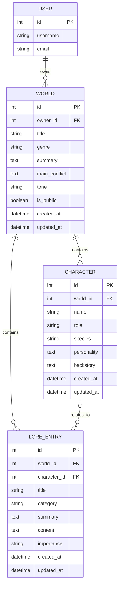

# Lorekeeper


## Introduction

Lorekeeper is a full-stack Django web application designed for writers, roleplayers, tabletop game masters and creative hobbyists who want a structured place to create, organise and optionally share fictional worlds with others.

The application allows registered users to create fictional worlds and attach related worldbuilding records such as characters and lore entries. Users can choose whether each world is public or private. Public worlds can be browsed through a public world library, while private worlds remain visible only to their owner.

---

Worldbuilding notes often become scattered across notebooks, documents, message threads, spreadsheets or disconnected files. Lorekeeper solves this by giving users one organised place to store the core parts of a fictional setting with a visually appealing theme to separate text-heavy lore into something more interactive. It has collapsible elements to easily keep track of details within each world.

The application provides value by allowing users to:

- Create structured fictional worlds.
- Attach characters and lore entries to specific worlds.
- Keep private worldbuilding notes secure.
- Share selected worlds publicly for inspiration.
- Search and filter public worlds.
- Manage their own creative records through a private dashboard.

The goal is to keep the app simple, beginner-friendly and useful without becoming a large or complicated writing platform.

---

## Live Website

Please visit the deployed website deployed via Heroku here:

[Live Lorekeeper Website](https://lorekeeper-b174be05c815.herokuapp.com/)

## Repository

You can view the GitHub repository here:

[GitHub Repository](https://github.com/CtrlAltKismet/lorekeeper)

## Required Technologies

This project uses the following technologies:

- HTML
- CSS
- JavaScript
- Python
- Django
- Relational database (SQLite and PostgreSQL)

---

## Table of Contents

- [Introduction](#introduction)
- [Live Website](#live-website)
- [Repository](#repository)
- [Required Technologies](#required-technologies)
- [UX and UI](#ux-and-ui)
  - [Project Goals](#project-goals)
  - [User Goals](#user-goals)
  - [Developer Goals](#developer-goals)
  - [Strategy](#strategy)
  - [User Stories](#user-stories)
  - [Site Structure](#site-structure)
  - [Wireframes](#wireframes)
  - [Design Choices](#design-choices)
  - [Layout and Components](#layout-and-components)
- [Features](#features)
  - [Existing Features](#existing-features)
  - [JavaScript Features](#javascript-features)
- [Mock-Ups](#mock-ups)
- [Agile Methodology](#agile-methodology)
  - [GitHub Issues](#github-issues)
  - [Project Board](#project-board)
  - [MoSCoW Prioritisation](#moscow-prioritisation)
  - [Story Points](#story-points)
  - [Completed Issues](#completed-issues)
  - [Won't Have Scope Control](#wont-have-scope-control)
- [Database Schema](#database-schema)
  - [Entity Relationship Diagram](#entity-relationship-diagram)
  - [Models](#models)
  - [Relationships](#relationships)
  - [Schema Justification](#schema-justification)
- [Tools and Technologies Used](#tools-and-technologies-used)
- [Installation](#installation)
- [Deployment](#deployment)
- [Security](#security)
- [Future Features](#future-features)
- [Testing](#testing)
  - [Testing Strategy](#testing-strategy)
  - [Manual Testing](#manual-testing)
  - [User Story Testing](#user-story-testing)
  - [CRUD Testing](#crud-testing)
  - [Authentication Testing](#authentication-testing)
  - [Ownership and Security Testing](#ownership-and-security-testing)
  - [Public/Private Visibility Testing](#publicprivate-visibility-testing)
  - [Search and Filter Testing](#search-and-filter-testing)
  - [JavaScript Testing](#javascript-testing)
  - [Responsive Testing](#responsive-testing)
  - [Browser Testing](#browser-testing)
  - [Device Testing](#device-testing)
  - [Lighthouse](#lighthouse)
  - [HTML Validation](#html-validation)
  - [CSS Validation](#css-validation)
  - [JavaScript Validation](#javascript-validation)
  - [Python/PEP8 Validation](#pythonpep8-validation)
  - [Bugs and Fixes](#bugs-and-fixes)
  - [Unfixed Bugs](#unfixed-bugs)
- [Credits](#credits)
- [Acknowledgements](#acknowledgements)


---

## UX and UI

### Project Goals

Lorekeeper aims to provide a structured worldbuilding organiser for creative users who want to create, manage and optionally share fictional worlds.

The main project goals are to:

- provide a clear introduction to the application and its purpose;
- allow users to register, log in and log out;
- allow users to create, view, edit and delete worldbuilding records;
- allow users to manage private records securely;
- allow selected public worlds to be browsed by other users;
- make longer worldbuilding records easier to read through collapsible sections;
- provide a creative visual theme that supports the purpose of the application.

### User Goals

Users should be able to:

- understand what Lorekeeper is from the homepage;
- register, log in and log out;
- create, view, edit and delete their own worlds, characters linked to worlds, and lore entries;
- optionally link lore entries to characters;
- mark worlds as public or private;
- browse public worlds;
- search and filter public worlds;
- get clear feedback after actions;
- avoid accidentally deleting records through confirmation pages.

### Developer Goals

The developer goals for this project are to:

- build a full-stack Django application using Python;
- use a relational database structure that fits the project domain;
- implement CRUD functionality for multiple related models;
- use authentication and ownership checks to protect user content;
- use custom HTML, CSS and JavaScript;
- deploy the finished project to Heroku;
- document the project clearly in the README;
- maintain evidence of Agile planning, testing, bugs and fixes.

### Website Owner Goals

The website owner wants to provide a free and accessible worldbuilding organiser that:

- stores structured worldbuilding data.
- supports user accounts and ownership.
- allows public/private world visibility.
- encourages users to explore public worlds.
- uses an interface that feels creative and relevant to worldbuilding.
- allows for future features to be easily integrated within the website.

### Strategy

| User Group | Need |
|---|---|
| Writers | Store fictional settings, character notes and lore in one organised place. |
| Roleplayers | Manage original worlds, characters and background lore. |
| Tabletop game masters | Keep lightweight campaign/world notes without needing a complex system. |
| Creative hobbyists | Structure creative ideas in a simple web app. |
| Browsing users | View public worlds for inspiration. |

---

### User Stories

The following user stories were created to guide the design and development of Lorekeeper. They reflect the needs of visitors, registered users and the developer, with a focus on worldbuilding content management, CRUD functionality, database relationships, public/private visibility, accessibility, deployment and project documentation.

The implemented user stories focus on the Milestone 3 MVP: account registration, authentication, world creation, character management, lore entry management, public world browsing, search/filter functionality, responsive styling, JavaScript enhancement, security and deployment.

The user stories for Lorekeeper were created as part of the Agile planning process. Each user story was written from the perspective of a user or developer need and was used to guide the design, development and testing of the application.

---

## Completed User Stories

### User Story 1 - Initial Django Project Setup

As a developer, I want to create and configure the initial Django project, so that I can begin development of Lorekeeper.

**Acceptance Criteria**

- Virtual environment created.
- Django installed.
- Django project created.
- Worlds app created.
- Migrations applied.
- GitHub repository connected.
- Application runs successfully locally.

**Story Points:** 1  
**Priority:** Must Have  
**Status:** Complete

---

### User Story 2 - Create Lorekeeper Homepage

As a visitor, I want to view a homepage so that I can understand what Lorekeeper is and what it does.

**Acceptance Criteria**

- Homepage route created.
- Homepage template created.
- Lorekeeper branding displayed.
- Navigation bar visible.
- Homepage loads successfully.

**Story Points:** 2  
**Priority:** Must Have  
**Status:** Complete

---

### User Story 3 - Create Base Template and Navigation

As a visitor, I want consistent navigation and layout across the site so that I can move between pages easily and understand where I am.

**Acceptance Criteria**

- `base.html` template created.
- Homepage extends `base.html`.
- Navigation menu added.
- Navigation includes Home and About links.
- Layout is reusable for future templates.
- Page still loads successfully at `http://127.0.0.1:8000/`.

**Tasks**

- Create `base.html` inside `worlds/templates/worlds/`.
- Move the main HTML boilerplate into `base.html`.
- Add navigation links.
- Add a content block.
- Update `home.html` to extend `base.html`.
- Test homepage locally.
- Commit and push changes.

**Story Points:** 2  
**Priority:** Must Have  
**Status:** Complete

---

### User Story 4 - Create About Page

As a visitor, I want to learn what Lorekeeper is and who it is for so that I can understand whether the app is useful for my writing, roleplay, or worldbuilding projects.

**Acceptance Criteria**

- About page template created.
- About page extends `base.html`.
- About page explains the purpose of Lorekeeper.
- About page explains the target audience.
- About page includes clear site-specific content.
- Navigation includes working About link.
- About page loads successfully in the browser.

**Tasks**

- Create `about.html` template.
- Add about view to `worlds/views.py`.
- Add about URL path to `worlds/urls.py`.
- Update `base.html` About navigation link.
- Test About page locally.
- Commit and push changes.

**Story Points:** 1  
**Priority:** Must Have  
**Status:** Complete

---

### User Story 5 - Implement User Registration

As a new user, I want to register for an account so that I can create and manage my own fictional worlds.

**Acceptance Criteria**

- Registration page is created.
- Registration form allows a new user to create an account.
- User is logged in after successful registration.
- User receives feedback after registering.
- Navigation includes Register link.
- Register link does not show when user is already logged in.
- Registration page extends `base.html`.
- Registration is tested locally.

**Tasks**

- Create register view.
- Create `register.html` template.
- Add register URL path.
- Update `base.html` navigation.
- Add success message after registration.
- Test creating a new account.
- Take screenshot evidence.
- Commit and push changes.

**Story Points:** 3  
**Priority:** Must Have  
**Status:** Complete

---

### User Story 6 - Implement User Login and Logout

As a registered user, I want to log in and log out so that I can securely access and leave my Lorekeeper account.

**Acceptance Criteria**

- Login page is created.
- User can log in with valid account details.
- User receives feedback after logging in.
- User can log out.
- User receives feedback after logging out.
- Navigation shows Login/Register when logged out.
- Navigation shows Dashboard/Logout when logged in.
- Login and logout functionality is tested locally.

**Tasks**

- Add Django authentication URLs.
- Create `login.html` template.
- Create logout view.
- Add logout URL path.
- Update `base.html` navigation links.
- Test login locally.
- Test logout locally.
- Take screenshot evidence.
- Commit and push changes.

**Story Points:** 2  
**Priority:** Must Have  
**Status:** Complete

---

### User Story 7 - Authentication

As a visitor, I want to create an account so that I can manage my own worlds.

**Acceptance Criteria**

- Registration form created.
- User account created successfully.
- Validation messages displayed.

**Story Points:** 3  
**Priority:** Must Have  
**Status:** Complete

---

### User Story 8 - Create User Dashboard

As a user, I want a dashboard so that I can manage my worlds.

**Acceptance Criteria**

- Logged-in users can access the dashboard.
- Logged-out users are redirected to login.
- Dashboard only displays worlds owned by the current user.
- Each world displays key information.
- Empty state appears if no worlds exist.
- Create World link appears.
- Navigation Dashboard link works.

**Story Points:** 3  
**Priority:** Must Have  
**Status:** Complete

---

### User Story 9 - Create World Model

As a developer, I want to create a World model so that the application can store fictional world records in the database.

**Acceptance Criteria**

- World model is created in `models.py`.
- World model includes fields for title, genre, summary, main conflict, tone, visibility, owner, created date and updated date.
- World model is linked to Django's built-in User model.
- Migrations are created and applied successfully.
- World model is registered in Django Admin.
- Model can be viewed in the Django Admin panel.
- Changes are committed and pushed to GitHub.

**Tasks**

- Add World model to `worlds/models.py`.
- Add owner ForeignKey relationship to User.
- Add public/private visibility field.
- Create migrations.
- Apply migrations.
- Register World model in `admin.py`.
- Create superuser if needed.
- Test World model in admin.
- Take screenshot evidence.
- Commit and push changes.

**Story Points:** 3  
**Priority:** Must Have  
**Status:** Complete

---

### User Story 10 - Implement World Create Functionality

As a user, I want confirmation that my worlds have been created.

**Acceptance Criteria**

- User can create a world.
- Form validation works.
- Success message displayed.

**Story Points:** 3  
**Priority:** Must Have  
**Status:** Complete

---

### User Story 11 - Implement World Detail View

As a user, I want to ensure I can access my world's URL so that I can see the world's information displayed.

**Acceptance Criteria**

- Logged-in users can open a detail page for their own worlds.
- The dashboard includes a link to view each world.
- The world detail page displays the world title, genre, summary, main conflict, tone, public/private status, created date and updated date.
- Logged-out users are redirected to the login page where appropriate.
- Users cannot view private worlds owned by another user.
- A clear message or 404 page is shown if a user tries to access a world they do not own.

**Story Points:** 3  
**Priority:** Must Have  
**Status:** Complete

---

### User Story 12 - Implement World Update Functionality

As a logged-in user, I want to edit my own worlds so that I can update or correct my worldbuilding information.

**Acceptance Criteria**

- Logged-in users can access an edit page for worlds they own.
- Logged-out users are redirected to the login page.
- Users cannot edit worlds owned by another user.
- The edit form is pre-filled with the existing world information.
- Submitting valid changes updates the world record in the database.
- After editing, the user is redirected to the world detail page.
- A success message confirms the world was updated.
- The updated information is immediately visible on the world detail page.

**Story Points:** 3  
**Priority:** Must Have  
**Status:** Complete

---

### User Story 13 - Implement World Delete Functionality

As a logged-in user, I want to delete my own worlds so that I can remove worldbuilding records I no longer need.

**Acceptance Criteria**

- Logged-in users can access a delete confirmation page for worlds they own.
- Logged-out users are redirected to the login page.
- Users cannot delete worlds owned by another user.
- The delete page clearly asks the user to confirm before deleting.
- The user can cancel and return to the world detail page.
- Confirming deletion removes the world from the database.
- After deletion, the user is redirected to the dashboard.
- A success message confirms the world was deleted.
- The deleted world no longer appears on the dashboard.

**Story Points:** 3  
**Priority:** Must Have  
**Status:** Complete

---

### User Story 14 - Create Character Model

As a user, I want to create a character and link them to a world so that I may build a world's lore with my characters.

**Acceptance Criteria**

- Character model exists.
- Character belongs to a World.
- Character can be created.
- Character appears in admin.
- Migrations run successfully.

**Story Points:** 3  
**Priority:** Must Have  
**Status:** Complete

---

### User Story 15 - Implement Character CRUD

As a user, I want to be able to create, view, edit and delete characters so I have full control over my worlds and characters.

**Acceptance Criteria**

- Create character functionality applied.
- View character functionality applied.
- Edit character functionality applied.
- Delete character functionality applied.

**Story Points:** 5  
**Priority:** Must Have  
**Status:** Complete

---

### User Story 16 - Create Lore Entry Model

As a logged-in user, I want to create lore entries linked to my fictional worlds, so that I can organise important worldbuilding information such as history, culture, magic, politics, technology, religion, species, and timeline events.

**Acceptance Criteria**

- A `LoreEntry` model is created in `worlds/models.py`.
- Each lore entry is linked to one World using a foreign key.
- One world can have many lore entries.
- If a world is deleted, its related lore entries are also deleted.
- The model includes useful fields for storing structured lore information.
- The model includes created and updated timestamps.
- The model has a clear string representation.
- The model is ordered consistently.
- A migration is created and applied successfully.
- The `LoreEntry` model is registered in Django Admin.
- Lore entries can be created and viewed in Django Admin.
- Testing evidence is collected with screenshots.

**Story Points:** 3  
**Priority:** Must Have  
**Status:** Complete

---

### User Story 17 - Implement Lore Entry CRUD

As a user, I want to be able to create, view, edit, and delete lore entries for my worlds and characters so that I may have complete control over their lore.

**Acceptance Criteria**

- Create lore entry functionality applied.
- View lore entry functionality applied.
- Edit lore entry functionality applied.
- Delete lore entry functionality applied.

**Story Points:** 5  
**Priority:** Must Have  
**Status:** Complete

---

### User Story 18 - Public Worlds

As a logged-in user, I want to choose whether my worlds are public or private, so that I can control which worlds are shared with other users and which worlds remain visible only to me.

**Acceptance Criteria**

- The World model includes a public/private visibility field that allows each world to be marked as either public or private.
- When creating or editing a world, the logged-in user can choose whether the world is public or private.
- A logged-in user can view, edit and delete their own worlds whether they are public or private.
- A public world can be viewed by users who are not the owner.
- A private world cannot be viewed by users who are not the owner.
- If a non-owner attempts to access a private world directly through the URL, they are blocked or shown a 404/not found response.
- Users who are not the owner cannot edit or delete a world, even if the world is public.
- The dashboard continues to show only worlds owned by the logged-in user.
- Public/private status is clearly displayed on relevant pages, such as the dashboard and world detail page.
- Success messages display when a world's public/private status is updated.
- Manual testing evidence is collected for owner access, non-owner public access, non-owner private access, and edit/delete protection.

**Story Points:** 3  
**Priority:** Must Have  
**Status:** Complete

---

### User Story 19 - Create Public World Library

As a user, I want to view public worlds with easy navigation so that I may see what other users have created on the website.

**Acceptance Criteria**

- A Public Worlds page is created and accessible from the main navigation.
- The Public Worlds page displays only worlds marked as public.
- Private worlds do not appear in the Public Worlds list.
- Each public world displays key information such as title, genre, summary and creator/owner.
- Each public world links to its world detail page.
- Logged-out users can access the Public Worlds page.
- Logged-in users can access the Public Worlds page.
- Non-owners can view public world details but cannot see edit, delete, add character or add lore entry links.
- If no public worlds exist, a clear empty state message is displayed.
- Manual testing evidence is collected for logged-out access, logged-in access, public world display, private world exclusion and detail page links.

**Story Points:** 3  
**Priority:** Must Have  
**Status:** Complete

---

### User Story 20 - Implement Search Functionality

As a user, I want to be able to search for specific worlds so that I can easily navigate the website.

**Acceptance Criteria**

- A search form is available on the Public Worlds page.
- Users can search public worlds by title.
- Users can search public worlds by summary.
- Users can search public worlds by genre/tone where appropriate.
- Search results only include worlds marked as public.
- Private worlds never appear in search results.
- Search results update after the user submits a search query.
- If matching public worlds are found, they are displayed clearly.
- If no matching public worlds are found, a clear empty state message is displayed.
- The search query remains visible in the search box after submission.
- Logged-out users can use the search feature.
- Logged-in users can use the search feature.
- Manual testing evidence is collected for successful searches, no-result searches, private world exclusion, logged-out use and logged-in use.

**Story Points:** 3  
**Priority:** Must Have  
**Status:** Complete

---

### User Story 21 - Add Public World Filters

As a user, I want to filter worlds to narrow my search results in the Public World Library.

**Acceptance Criteria**

- A genre filter is available on the Public Worlds page.
- Users can filter public worlds by genre.
- Users can combine the genre filter with the search box.
- Private worlds never appear in filtered results.
- A clear empty state message displays if no public worlds match the selected filter/search.
- The selected filter remains visible after submission.
- A clear/reset option is available.
- Manual testing evidence is collected for genre filtering, combined search and filter, no-result filtering, and private world exclusion.

**Story Points:** 3  
**Priority:** Should Have  
**Status:** Complete

---

### User Story 22 - Create ERD / Database Schema

As a developer, I want to create an Entity Relationship Diagram (ERD) and document database relationships so that the database structure is planned, implemented correctly, and can be evidenced within the project documentation.

**Acceptance Criteria**

- An ERD is created showing the implemented database models.
- The ERD includes User, World, Character and LoreEntry.
- The ERD shows one-to-many relationships between User and World, World and Character, and World and LoreEntry.
- The ERD shows the optional relationship between Character and LoreEntry.
- The README includes a database schema section.
- The schema section explains each model, key fields and relationships.
- The schema documentation matches the implemented Django models.
- Screenshot/image evidence of the ERD is saved for documentation.

**Story Points:** 3  
**Priority:** Must Have  
**Status:** Complete

---

### User Story 23 - Add Dashboard Counters

As a user, I want to see summary counts on my dashboard so that I can quickly understand how much content I have created.

**Acceptance Criteria**

- Dashboard shows numbers of worlds created.
- World cards show number of related characters.
- World cards show number of related lore entries.
- Counts update when records are created or deleted.

**Story Points:** 2  
**Priority:** Should Have  
**Status:** Complete

---

### User Story 24 - Add User-Friendly Form Validation Messages

As a user, I want clear validation messages when I submit a form incorrectly so that I can understand what needs fixing.

**Acceptance Criteria**

- Required fields show clear validation messages when left empty.
- Form errors display close to the relevant fields.
- Create and edit forms remain populated after invalid submission.
- World, Character and Lore Entry forms have helpful labels and help text.
- Validation behaviour is tested manually.
- Screenshot evidence is collected.

**Story Points:** 3  
**Priority:** Should Have  
**Status:** Complete

---

### User Story 25 - Website Styled with Clear and Responsive Design

As a user, I want the Lorekeeper website to have a clear, consistent and responsive design, so that I can navigate the application easily and manage my worlds, characters and lore entries in a more enjoyable way.

**Acceptance Criteria**

- The site uses a custom CSS file linked through Django static files.
- The base layout has consistent styling across all pages.
- The navigation menu is clearly styled and easy to use.
- Pages use a consistent colour scheme, spacing and typography.
- Dashboard world cards are visually clearer and easier to scan.
- Public World Library cards are styled consistently.
- Forms are styled so they are easier to read and complete.
- Buttons and links have clear visual states.
- Success and error messages are styled clearly.
- The layout is responsive on desktop, tablet and mobile screen sizes.
- The design supports accessibility with readable contrast, clear focus states and labelled form fields.
- Manual testing evidence is collected with screenshots.
- Changes are committed and pushed to GitHub.

**Story Points:** 5  
**Priority:** Must Have  
**Status:** Complete

---

### User Story 26 - Add Public and Private Status Badges

As a user, I want to clearly see whether my worlds are public or private so that I understand which content is visible to others.

**Acceptance Criteria**

- Public worlds display a public badge.
- Private worlds display a private badge.
- Badges are visible on dashboard world cards.
- Badge styling is consistent with the site design.

**Story Points:** 1  
**Priority:** Could Have  
**Status:** Complete

---

### User Story 27 - Add JavaScript Enhancements

As a user, I want small interactive features, so that the website feels easier and smoother to use.

**Acceptance Criteria**

- A custom JavaScript file is created in the static folder.
- The JavaScript file is linked correctly in `base.html`.
- JavaScript does not break core Django functionality if unavailable.
- The feature is tested manually.
- Screenshot evidence is collected.
- JavaScript passes a linter with no major issues.

**Story Points:** 2  
**Priority:** Must Have  
**Status:** Complete

---

### User Story 28 - Add Collapsible World Detail Sections

As a user, I want to expand and collapse sections on a world detail page, so that I can browse larger worldbuilding records more easily.

**Acceptance Criteria**

- The world detail page has collapsible sections.
- Users can open and close sections such as world information, characters, lore entries and record details.
- JavaScript is used to control the expand/collapse behaviour.
- The page still works if JavaScript does not load.
- Existing world, character and lore entry CRUD functionality is not affected.

**Story Points:** 3  
**Priority:** Should Have  
**Status:** Complete

---

### User Story 29 - Add Live Preview for World Creation Form

As a user, I want to preview my world card while completing the form so that I can see how my world summary will appear before saving.

**Acceptance Criteria**

- Preview updates as user types.
- Preview includes world title.
- Preview includes world genre or tone if available.
- Feature is optional and does not replace server-side form submission.

**Story Points:** 5  
**Priority:** Could Have  
**Status:** Complete

---

### User Story 30 - Prepare Application for Heroku Deployment

As a developer, I want to prepare Lorekeeper for deployment on Heroku with PostgreSQL, so that the application can run in a production environment and meet the Milestone 3 deployment requirements.

**Acceptance Criteria**

- Required deployment packages are installed.
- `requirements.txt` is updated.
- A Procfile is created.
- Django settings are updated for environment variables.
- Secret key is not exposed in the GitHub repository.
- `DEBUG` can be turned off in production.
- Heroku PostgreSQL database can be used in production.
- Static files are configured for deployment.
- The app can be deployed to Heroku.
- Migrations can be run on the deployed PostgreSQL database.
- The deployed site is tested after deployment.
- Deployment steps are documented in the README.

**Story Points:** 5  
**Priority:** Must Have  
**Status:** Complete

---

## Incomplete User Stories

The following user stories were not completed for the MVP. These have been documented honestly to show scope control and to explain which features may be added in future versions.

---

### Incomplete User Story 1 - Add Location Records

As a user, I want to add locations to my worlds so that I can organise important places, regions, buildings, and landmarks within my fictional setting.

**Acceptance Criteria**

- Location model created.
- Location linked to World model.
- User can create a location for their own world.
- User can view locations on the world detail page.
- User can edit and delete their locations.

**Story Points:** 3  
**Priority:** Should Have  
**Status:** Not Complete

**Reason Not Completed**

Location records were left out of the MVP to keep the project focused on completing and testing the core database relationships between users, worlds, characters and lore entries.

---

### Incomplete User Story 2 - Add Empty State Messages

As a user, I want to see helpful messages when I have not created any records yet so that I understand what to do next.

**Acceptance Criteria**

- Dashboard displays a message when no worlds exist.
- World detail page displays messages when no characters, lore entries, or locations exist.
- Empty state messages include clear action links.
- Messages are written in a friendly and helpful tone.

**Story Points:** 2  
**Priority:** Should Have  
**Status:** Partially Complete

**Reason Not Completed**

Some empty state messages were implemented, such as the dashboard empty state and world detail messages for missing records. This was not treated as a fully completed standalone issue because locations were not added to the MVP.

---

### Incomplete User Story 3 - Add Comments on Public Worlds

As a logged-in user, I want to comment on public worlds so that I can interact with other creators and give feedback.

**Acceptance Criteria**

- Logged-in users can add comments to public worlds.
- Comments display on public world detail pages.
- Users can delete their own comments.
- Comment form is hidden from logged-out users.

**Story Points:** 5  
**Priority:** Could Have  
**Status:** Not Complete

**Reason Not Completed**

Comments were left out of the MVP to avoid adding extra moderation, ownership and security complexity before the deadline.

---

### Incomplete User Story 4 - Add Random Worldbuilding Prompt Generator

As a user, I want to generate a random worldbuilding prompt so that I can get inspiration when creating or expanding a fictional world.

**Acceptance Criteria**

- Prompt button added to a suitable page.
- Clicking button displays a random prompt.
- Prompt generator uses JavaScript.
- Feature does not affect core CRUD functionality.

**Story Points:** 3  
**Priority:** Could Have  
**Status:** Not Complete

**Reason Not Completed**

A random prompt generator was left as a future enhancement because the implemented JavaScript was focused on collapsible content sections and a live world preview.

---

## Won't Have User Stories

The following user stories were intentionally marked as Won't Have for the MVP. They were kept in the product backlog to show scope control and to explain how the project avoided unnecessary complexity.

---

### Won't Have User Story 1 - Do Not Add Image Uploads During MVP

As a developer, I want to avoid image uploads during the MVP so that the project stays focused on core database-backed CRUD functionality and avoids unnecessary deployment complexity.

**Acceptance Criteria**

- Image upload fields are not included in MVP models.
- Media file storage is not configured for MVP.
- Image uploads are listed as a future feature in the README.

**Story Points:** 0  
**Priority:** Won't Have  
**Status:** Not Implemented

---

### Won't Have User Story 2 - Do Not Add AI Generation During MVP

As a developer, I want to avoid AI generation features during the MVP so that the application remains focused on user-created worldbuilding records.

**Acceptance Criteria**

- No AI generation feature is implemented.
- No external AI API is added.
- AI generation is listed as a future feature in the README.

**Story Points:** 0  
**Priority:** Won't Have  
**Status:** Not Implemented

---

### Won't Have User Story 3 - Do Not Add Collaborative Editing During MVP

As a developer, I want to avoid collaborative editing during the MVP so that permissions and ownership remain simple and secure.

**Acceptance Criteria**

- Worlds remain owned by one user.
- No shared editing permissions are implemented.
- Collaborative editing is listed as a future feature in the README.

**Story Points:** 0  
**Priority:** Won't Have  
**Status:** Not Implemented

---

### Won't Have User Story 4 - Do Not Add Private Messaging During MVP

As a developer, I want to avoid private messaging during the MVP so that the project does not expand beyond the core worldbuilding organiser scope.

**Acceptance Criteria**

- No private messaging model is created.
- No inbox or messaging templates are created.
- Private messaging is listed as a future feature in the README.

**Story Points:** 0  
**Priority:** Won't Have  
**Status:** Not Implemented

---

### Won't Have User Story 5 - Do Not Add Rich Text Editor During MVP

As a developer, I want to avoid adding a rich text editor during the MVP so that the project avoids unnecessary dependencies and focuses on reliable form handling.

**Acceptance Criteria**

- Standard Django form fields are used.
- No rich text editor dependency is installed.
- Rich text editing is listed as a future feature in the README.

**Story Points:** 0  
**Priority:** Won't Have  
**Status:** Not Implemented

---

### Site Structure

The Lorekeeper website uses a shared `base.html` template to keep the layout, navigation, messages and footer consistent across the application. This helps users move around the site without having to relearn the layout on each page. The navigation bar is displayed at the top of every page and changes depending on whether the user is logged in or logged out. This keeps the interface relevant to the user’s current state and avoids showing account management links to visitors who cannot use them.

Logged-out users can access the public areas of the site, including the Home page, About page, Public Worlds page, Register page and Login page. Logged-in users can access these same public pages, but also gain access to private account features such as the Dashboard, Create World page and Logout option. This structure supports the purpose of the application because it separates public browsing from private content management.

The site has been designed around a clear worldbuilding workflow: users can learn what Lorekeeper is, register or log in, create a world, add related characters and lore entries, and optionally share selected worlds publicly. The structure supports both visitors who want to browse public worlds and registered users who want to manage their own creative records.

The **Home Page** introduces Lorekeeper and explains the core purpose of the application. It presents the website as a fictional worldbuilding organiser for writers, roleplayers, tabletop game masters and creative hobbyists. The homepage acts as the first point of entry and gives users a clear overview of what the site offers. It also provides links that direct users towards exploring public worlds or creating their own account.

The **About Page** provides more detail about the purpose of Lorekeeper and who the application is designed for. This page supports new visitors by explaining how the site can be used to organise fictional settings, characters and lore entries. It also reinforces the value of the application as a structured alternative to scattered notes, documents or disconnected files.

The **Public Worlds Page** allows both logged-in and logged-out users to browse worlds that have been marked as public by their owners. This page supports discovery and inspiration by allowing users to view shared fictional settings. It includes search and genre filter functionality so users can locate worlds more easily. Private worlds are excluded from this page, which helps protect user content while still allowing optional public sharing.

The **Register Page** allows new users to create an account. Registration is required before users can create and manage their own worlds. After registering, users are automatically logged in, which creates a smoother user journey and allows them to begin using the application immediately.

The **Login Page** allows existing users to securely access their account. Once logged in, the navigation updates to show account-specific options such as the Dashboard, Create World and Logout links. This ensures that users can quickly access the main management features of the application.

The **Dashboard Page** is the main private area for logged-in users. It displays only the worlds created by the currently logged-in user, whether those worlds are public or private. The dashboard allows users to locate and manage their own content from one central place. It also displays useful counters, including the total number of worlds created and the number of related characters and lore entries attached to each world.

The **Create World Page** allows logged-in users to create a new fictional world. This is the main parent record in the application. Users can enter details such as the world title, genre, summary, main conflict, tone and public/private status. The form also includes a JavaScript live preview so users can see how their world card will appear before saving.

The **World Detail Page** displays the full information for a selected world. This page acts as the main hub for a world’s related content, including characters and lore entries. Owner-only actions such as edit, delete, add character and add lore entry are only shown to the user who owns the world. Public visitors can view public world details, but cannot manage or alter another user’s content.

The **Edit World Page** allows users to update worlds they own. The form is pre-filled with the existing world information so that users can make changes without re-entering all details. After saving, the updated information is reflected immediately on the world detail page.

The **Delete World Page** provides a confirmation screen before a world is removed. This helps prevent accidental deletion. If a world is deleted, its related characters and lore entries are also deleted through the database relationship, so the confirmation page is an important part of protecting user data.

The **Character Detail Page** displays information about a character linked to a specific world. Characters are managed through their parent world, which keeps the structure organised and prevents characters from existing without a related fictional setting. Users can view details such as the character name, role, species, personality and backstory.

The **Add/Edit/Delete Character Pages** allow logged-in users to create, update and remove characters from worlds they own. These pages support the character CRUD functionality and help users build structured character records within their fictional worlds.

The **Lore Entry Detail Page** displays a full lore record linked to a world. Lore entries can be used for history, culture, magic, technology, politics, religion, species, timeline events, geography or other worldbuilding notes. A lore entry can also optionally be linked to a character from the same world.

The **Add/Edit/Delete Lore Entry Pages** allow logged-in users to create, update and remove lore entries from worlds they own. The lore entry form includes a filtered related-character dropdown, meaning users can only link lore entries to characters from the current world. This keeps the database relationships logical and prevents users from accidentally connecting records across unrelated worlds.

The site structure guides users through a logical journey of discovering the application, creating an account, building a world, adding connected records and optionally sharing public content. The consistent layout, authentication-aware navigation, dashboard structure and owner-only management links help keep the application clear, secure and easy to use.

Homepage:


World Libary:


Create World:


World Detail Page:


About Page:


Dashboard:


Register:


### Wireframes

Wireframes were created during the planning stage to help organise the layout and structure of the main Lorekeeper pages before and during development. Due to the size of the application and the number of CRUD pages, wireframes were created for the main page types rather than every individual URL.

This was appropriate because several pages share the same layout pattern. For example, the create and edit pages for worlds, characters and lore entries all use a similar form structure. The delete pages also follow the same confirmation layout, while character and lore entry detail pages use similar detail-page layouts.

The wireframes therefore focus on the key user journeys and reusable layouts, including the homepage, public world library, dashboard, world detail page, form pages and delete confirmation pages.

Desktop wireframes were prioritised due to time constraints. Responsive behaviour was instead evidenced through the final deployed website, responsive screenshots and responsive testing across desktop, tablet and mobile screen sizes.

Wireframes:

Homepage:


Dashboard:


Create World:


World Details:


World Library:


About Page:


Register Page:


### Design Choices

### Visual Theme

Lorekeeper uses a custom **cosmic multiverse archive** visual theme. The theme was chosen to support the purpose of the application as a fictional worldbuilding organiser.

The styling uses:

- dark cosmic background colours;
- blues, purples, pinks and cyan highlights;
- starfield / nebula-inspired gradients;
- rounded glass-style panels;
- card-based layouts;
- soft glow effects;
- hover effects on cards, links and buttons;
- consistent form styling;
- clear public/private badges;
- responsive layouts for smaller screens. 

### Static Files

The main custom stylesheet is stored at:

```text
worlds/static/worlds/css/style.css
```

It is linked in `base.html` using:

```django

<link rel="stylesheet" href="">
```

### Fonts

Google Fonts are loaded in 'base.html'.

```html
<link href="https://fonts.googleapis.com/css2?family=Lexend:wght@300;400;500;600;700&family=Roboto:wght@300;400;500;700&display=swap" rel="stylesheet">
```

The main font stack is:

```css
--font-main: "Lexend", "Roboto", Arial, sans-serif;
```

These fonts have been chosen to be dyslexia/visual stress-friendly.

### Animated Background

Lorekeeper uses a custom animated background to support the visual theme of the application. Since the app is designed as a fictional worldbuilding archive, the interface was intended to feel like a cosmic library or multiverse map rather than a plain database application.

The background was created using CSS only. It uses a combination of:

- 'linear-gradient()'
- 'radial-gradient()'
- 'body::before'
- 'body::after'
- '@keyframes' animation.

The main body background uses several layered CSS gradients. The 'linear-gradient()' creates the base colour blend across the page, while the 'radial-gradient()' layers create softer glowing areas that look like nebula clouds.

The 'body::before' pseudo-element creates an extra decorative nebula layer. It is fixed to the viewport, blurred with 'filter: blur()' and animated slowly using the 'nebulaDrift' keyframes.

The 'body::after' pseudo-element creates the starfield effect. It uses several small 'radial-gradient()' layers, each with different 'background-size' values. This creates the appearance of stars at different positions and sizes. The 'starFloat' keyframes animate the 'background-position', which makes the stars move slowly across the page.

Both pseudo-elements use 'pointer-events: none;' so they do not interfere with clicking links, buttons or forms. They also use negative 'z-index' values so they sit behind the main page content.

### Reduced Motion Accessibility

The animated background is decorative only and does not affect the functionality of the website. To support accessibility, a 'prefers-reduced-motion' media query is included. This reduces animation and transition effects for users who have selected reduced motion in their system settings.

```css
@media (prefers-reduced-motion: reduce) {
    *,
    *::before,
    *::after {
        animation-duration: 0.001ms !important;
        animation-iteration-count: 1 !important;
        scroll-behavior: auto !important;
        transition-duration: 0.001ms !important;
    }
}
```

### Responsive Design

Media queries were added for:

```css
@media (max-width: 880px)
@media (max-width: 640px)
```

Responsive changes include:

- navigation stacking/wrapping;
- home hero layout stacking;
- search form stacking;
- footer stacking;
- full-width mobile buttons;
- responsive card grids;
- adjusted padding and border radius;
- badge stacking on smaller screens.

### Accessibility Considerations

Accessibility considerations include:

- semantic HTML where possible;
- form labels generated through Django forms;
- visible focus states;
- readable colour contrast;
- browser validation for required fields;
- server-side validation fallback;
- accessible `aria-expanded` attributes on collapsible JavaScript buttons;
- reduced-motion support for decorative animation;
- content remaining visible by default if JavaScript does not run.

---

### Layout and Components

The layout uses:

- a consistent header and navigation;
- responsive page containers;
- hero panels for important page introductions;
- card grids for worlds, features and dashboard records;
- status badges for public/private states;
- action rows for view/edit/delete links;
- consistent form styling;
- confirmation pages for destructive actions;
- a footer with navigation links and inline SVG icons.

---

## Features

### Existing Features

#### Homepage

The homepage introduces Lorekeeper and explains that it can be used to create, organise and share fictional worlds.

#### About Page

The About page explains the purpose of Lorekeeper, the intended audience and how the application supports creative worldbuilding.


#### Public World Library

The Public World Library displays only worlds marked as public. It is accessible to logged-in and logged-out users.

Each public world card includes key information such as:

- title.
- genre.
- creator username.
- summary.
- public status.
- link to view the world.

Private worlds do not appear in the library.

#### Create World Page

The create world page allows users to create their own world and decide if they want it public or private. The form has validation to ensure required fields are filled in.

#### Create Character/Lore Entry Pages

Much like the create world page, the create character and create lore entry pages allow users to fill out forms and link them to worlds/characters where necessary. These forms also have validation for required fields.

#### User Registration

Users can register for an account using Django's built-in 'UserCreationForm'. After successful registration, the user is automatically logged in and shown a success message.

#### Login and Logout

Users can log in using Django's authentication system and log out using a custom logout view that displays a success message.

#### Dashboard

The dashboard allows users to see all of their created worlds, whether public or private. This is where they can edit and update their worlds, delete them, or make them private/public if needed.

The dashboard includes:

- total world count.
- per-world character count.
- per-world lore entry count.
- public/private status badges.
- links to view details.
- create world link.
- empty state when no worlds exist.

#### Dashboard Counters

Dashboard counters give users quick feedback about their content.

The dashboard shows:

- total number of worlds owned by the logged in user.
- character count for each world.
- lore entry count for each world.

The count updates when related records are added or deleted.


#### World CRUD

Logged-in users can create, view, update and delete their own worlds. 

World records include:

- title.
- genre.
- summary.
- main conflict.
- tone.
- public/private status.
- created date.
- updated date.

The owner is assigned automatically from the logged-in user and is not exposed as a form field. 

#### Character CRUD

Users can create characters linked to worlds they own. Characters are managed through their parent world.

Character records include:

- name.
- role.
- species.
- personality.
- backstory.
- created date.
- updated date.

Characters appear on their related world detail page and can be opened on their own detail page.

#### Lore Entry CRUD

Users can create lore entries linked to worlds they own. Lore entries can optionally be linked to a character from the same world.

Lore entry records include:

- title.
- category.
- summary.
- full content.
- importance.
- optional related character.
- created date.
- updated date.

The related character dropdown is filtered to characters from the current world only. This prevents users from linking a lore entry to a character from another world.

#### Form Validation Feedback

Required fields use browser validation first, which prevents users from submitting blank required fields. A Django/server-side error summary block was also added to the form templates as a fallback if invalid form data reaches the server.

Validation feedback was added to:

- World form.
- Character form.
- Lore Entry Form.

#### Delete Confirmation Page

Worlds, characters and lore entries all have confirmation pages before deletion. This helps prevent accidental data loss.


#### Public and Private Worlds

Each world can be marked as public or private.

| User Type | Public World | Private World |
|---|---|---|
| Owner | Can view and manage | Can view and manage |
| Logged-in non-owner | Can view only | Blocked / 404 |
| Logged-out visitor | Can view only | Blocked / 404 |

Owner-only links such as edit, delete, add character and add lore entry are hidden from non-owners.

private world 404:


#### Public World Search

Users can search public worlds by:

- world title.
- partial title.
- summary.
- genre.
- tone.
- related character name.
- related character role.
- related character species.
- related lore entry title.
- related lore entry summary.
- related lore entry content.
- related lore entry category.

The search uses Django 'Q' objects and '.distinct()' to prevent duplicate worlds from appearing when multiple related records match the same query.

### Genre Filter

The Public World Library includes a genre filter. Users can filter by genre and combine the filter with a search query.

A clear/reset link appears when a search or filter is active.

#### Responsive Navigation

The website uses a shared 'base.html' template with consistent navigation. Navigation changes depending on authentication status.

Logged-out users can see:

- Home
- About
- Public Worlds
- Register
- Login

Logged-in users can see:

- Home
- About
- Public Worlds
- Dashboard
- Create World
- Logout

---

### JavaScript Features

Custom JavaScript is stored at:

```text
worlds/static/worlds/js/script.js
```

It is linked in 'base.html' with 'defer', so it loads after the HTML has been parsed:

```django
<script src="" defer></script>
```

The JavaScript is used for frontend enhancement only. Core data handling, validation and permissions are still managed by Django on the back end.

### Collapsible Detail Sections

Collapsible sections were added to:

- world detail pages;
- character detail pages;
- lore entry detail pages.

Users can expand and collapse longer content sections such as world details, characters, lore entries, character backstory, full lore entry content and record information.

This improves usability because large worldbuilding records can be browsed more easily without overwhelming the user.

The implementation uses:

- buttons with the class '.collapsible-toggle';
- 'data-target' attributes to identify the section to show/hide;
- 'aria-expanded' attributes for accessibility;
- a '.collapsed-section' CSS class to hide content.

Content is visible by default, so the page still works if JavaScript fails to load.

### Live World Form Preview

A live preview card was added to the create/edit world form.

As the user fills in the world form, JavaScript updates a preview card with:

- world title
- genre
- public/private status
- summary
- main conflict
- tone

This gives immediate feedback while the user creates or edits the main parent record in the application.

The live preview was limited to the World form because worlds are the central container record in Lorekeeper. Character and lore entry forms were not given live previews at this stage to keep the JavaScript focused and avoid unnecessary complexity before deployment.

### JavaScript Testing Notes

The browser console was checked after implementing JavaScript interactions. No JavaScript errors appeared, and the collapsible sections/live preview continued to work as expected.

---

## Mock-Ups

The following Mock-Ups have been created to showcase how each web page looks on Computer, Tablet and Smartphone.

Homepage:


About Page:


Public Worlds:


Dashboard:


Register:


Create World:


The design of the website follows the same, consistent styling throughout, making the website look more professional and uniform in design.

---

## Agile Methodology

### GitHub Issues

This project uses GitHub Issues to track planned features, bugs, improvements and documentation tasks.


### Project Board

GitHub Projects was used to manage the workflow and track GitHub issues.


### MoSCoW Prioritisation

MoSCoW prioritisation was used to decide which features were most important for the Milestone 3 MVP.

Priorities used:

- Must Have
- Should Have
- Could Have
- Won't Have

### Story Points

Story points were used to estimate the size of each GitHub Issue.

Story point guide:

| Points | Meaning |
|---|---|
| 1 | Very small task |
| 2 | Small task |
| 3 | Medium task |
| 5 | Large task |
| 8 | Very large task |

### Completed Issues

Completed issues include:

- Initial Django project setup
- Create homepage
- Create about page
- Implement user registration
- Implement user login and logout
- Create World model
- Implement World CRUD
- Create Character model
- Implement Character CRUD
- Create Lore Entry model
- Implement Lore Entry CRUD
- Implement public/private worlds
- Create public world library
- Implement search functionality
- Add genre filters
- Add dashboard counters
- Add validation feedback
- Add CSS styling
- Add JavaScript enhancements
- Deploy project

### Won't Have Scope Control

The following features were intentionally excluded from the MVP to avoid scope creep:

- image uploads;
- AI generation;
- collaborative editing;
- private messaging;
- rich text editor;
- complex maps or timelines;
- full TTRPG rules/stat system.

These may be included as future features, but for now have been listed as Won't Have items.

---

## Database Schema

Lorekeeper uses a relational database structure designed around worldbuilding content. The main purpose of the database is to allow registered users to create fictional worlds and organise related records such as characters and lore entries.

The implemented schema contains the following main models:

- Django's built-in 'User' model.
- 'World'.
- 'Character'.
- 'LoreEntry'.

Django's built-in 'User' model is used for authentication and ownership. The custom models are stored in the 'worlds' app.

### Entity Relationship Diagram



### Relationships

#### User to World

Each 'World' belongs to one registered user through the 'owner' field.

```python
owner = models.ForeignKey(
    settings.AUTH_USER_MODEL,
    on_delete=models.CASCADE,
    related_name='worlds'
)
```

This create a one-to-many relationship:

```text
User 1 ---- many Worlds
```

A single user can create many worlds, but each world belong to one user. If a user account is deleted, their worlds are also deleted because 'on_delete=models.CASCADE' is used.

This relationship supports ownership protection because users can only edit and delete worlds that belong to them.

#### World to Character

Each 'Character' belongs to one 'World'.

```python
world = models.ForeignKey(
    World,
    on_delete=models.CASCADE,
    related_name='characters'
)
```

This creates a one-to-many relationship:

```text
World 1 ---- many Characters
```

If a world is deleted, its related characters are also deleted. The 'related_name='characters'' allows characters to be accessed from a world using:

```python
world.characters.all()
```

#### World to LoreEntry

Each 'LoreEntry' belongs to one 'World'.

```python
world = models.ForeignKey(
    World,
    on_delete=models.CASCADE,
    related_name='lore_entries'
)
```

This creates a one-to-many relationship:

```text
World 1 ---- many Lore Entries
```

If a world is deleted, its related lore entries are also deleted. The 'related_name='lore_entries'' allows lore entries to be accessed from a world using:

```python
world.lore_entries.all()
```

#### Character to LoreEntry

A 'LoreEntry' can optionally be linked to a 'Character'.

```python
character = models.ForeignKey(
    Character,
    on_delete=models.SET_NULL,
    related_name='lore_entries',
    blank=True,
    null=True
)
```

This creates an optional relationship:

```text
Character 0/1 ---- many Lore Entries
```

A lore entry does not have to be connected to a character. This is useful because some lore entries are world-level information, such as history, culture, magic systems, politics, geography or timelines.

If a related character is deleted, the lore entry is not deleted. Instead, the 'character' field is set to 'NULL' because 'on_delete=models.SET_NULL' is used. This protects lore records from being accidentally removed when a character is deleted.

### Models

#### World Model

The 'World' model is the main container for fictional settings in Lorekeeper.

| Field | Type | Purpose |
|---|---|---|
| `owner` | ForeignKey | Links the world to the user who created it |
| `title` | CharField | Stores the name of the fictional world |
| `genre` | CharField with choices | Stores the world's genre |
| `summary` | TextField | Stores a summary of the world |
| `main_conflict` | TextField | Optional field for the central conflict, war, mystery or tension |
| `tone` | CharField | Optional field for the tone or mood of the world |
| `is_public` | BooleanField | Controls whether the world appears publicly |
| `created_at` | DateTimeField | Automatically stores when the world was created |
| `updated_at` | DateTimeField | Automatically stores when the world was last updated |

The 'World' model uses predefined genre choices to keep data consistent:

```python
GENRE_CHOICES = [
    ('fantasy', 'Fantasy'),
    ('sci_fi', 'Science Fiction'),
    ('horror', 'Horror'),
    ('modern', 'Modern'),
    ('historical', 'Historical'),
    ('supernatural', 'Supernatural'),
    ('other', 'Other'),
]
```

World records are ordered by newest first:

```python
class Meta:
    ordering = ['-created_at']
```

#### Character Model

The 'Character' model stores character profiles attached to a fictional world.

| Field | Type | Purpose |
|---|---|---|
| `world` | ForeignKey | Links the character to a specific world |
| `name` | CharField | Stores the character's name |
| `role` | CharField | Optional field for the character's role |
| `species` | CharField | Optional field for the character's species or type |
| `personality` | TextField | Optional field for personality details |
| `backstory` | TextField | Optional field for character history or background |
| `created_at` | DateTimeField | Automatically stores when the character was created |
| `updated_at` | DateTimeField | Automatically stores when the character was last updated |

Character records are ordered alphabetically by name:

```python
class Meta:
    ordering = ['name']
```

#### LoreEntry Model

The 'LoreEntry' model stores structured worldbuilding information attached to a world.

| Field | Type | Purpose |
|---|---|---|
| `world` | ForeignKey | Links the lore entry to a specific world |
| `character` | ForeignKey | Optionally links the lore entry to a character |
| `title` | CharField | Stores the lore entry title |
| `category` | CharField with choices | Stores the type/category of lore |
| `summary` | TextField | Optional short overview of the lore entry |
| `content` | TextField | Stores the full lore entry |
| `importance` | CharField with choices | Stores the importance level of the lore entry |
| `created_at` | DateTimeField | Automatically stores when the lore entry was created |
| `updated_at` | DateTimeField | Automatically stores when the lore entry was last updated |

The `LoreEntry` model uses category choices to keep lore organised:

```python
CATEGORY_CHOICES = [
    ('history', 'History'),
    ('culture', 'Culture'),
    ('magic', 'Magic'),
    ('technology', 'Technology'),
    ('politics', 'Politics'),
    ('religion', 'Religion'),
    ('species', 'Species'),
    ('timeline', 'Timeline'),
    ('geography', 'Geography'),
    ('miscellaneous', 'Miscellaneous'),
]
```

It also uses important choices:

```python
IMPORTANT_CHOICES = [
    ('low', 'Low'),
    ('medium', 'Medium'),
    ('high', 'High'),
    ('essential', 'Essential'),
]
```

Lore entries are ordered alphabetically by title:

```python
class Meta:
    ordering = ['title']
```

### Schema Justification

This schema fits Lorekeeper because the application is designed around organising fictional worldbuilding content.

The structure follows the natural hierarchy of the domain:

```text
A user owns worlds.
A world contains characters.
a world contains lore entries.
A lore entry may optionally relate to a character.
```

This allows users to build structured fictional settings without storing all information in one large, unorganised table.

This schema also supports privacy and ownership because worlds are linked to users. This allows the app to check whether the current user owns a world before allowing edit or delete actions.

---

---

## Tools and Technologies Used

| Technology | Purpose |
|---|---|
| HTML | Structure of Django templates. |
| CSS | Custom styling, layout, responsive design and animation. |
| JavaScript | Frontend interactivity including collapsible sections and live preview. |
| Python | Back-end programming language. |
| Django | Main web framework for models, views, forms, templates, authentication and routing. |
| SQLite | Local development database. |
| PostgreSQL | Production database used for the deployed application. |
| Git | Version control. |
| GitHub | Remote repository, issues and project board. |
| Heroku | Deployment platform used for the live application. |
| Google Fonts | Lexend and Roboto fonts. |
| ChatGPT | Image generation for website. |
| W3C | CSS and HTML validation |
| Code Institute CI Python Linter | Check python code |

---

## Installation

To run this project locally:

1. Clone the repository:

```bash
git clone https://github.com/CtrlAltKismet/lorekeeper.git
```

2. Navigate into the project folder:

```bash
cd lorekeeper
```

3. Create and activate a virtual environment:

```bash
python -m venv .venv
```

On Windows:

```bash
.\.venv\Scripts\Activate.ps1
```

4. Install dependencies:

```bash
pip install -r requirements.txt
```

5. Create an `.env` file and add required environment variables.

Example:

```text
SECRET_KEY=your-secret-key
DEBUG=True
DATABASE_URL=your-local-database-url-if-needed
```

6. Apply migrations:

```bash
python manage.py migrate
```

7. Create a superuser if admin access is needed:

```bash
python manage.py createsuperuser
```

8. Run the development server:

```bash
python manage.py runserver
```

9. Open the local site:

```text
http://127.0.0.1:8000/
```

---

## Deployment

Deployment was completed using Heroku.

Deployment steps:

1. Create or log into a Heroku account.
2. Create a new Heroku app.
3. Add the required config vars in Heroku settings.
4. Add the database add-on if required.
5. Connect the Heroku app to the GitHub repository.
6. Deploy from the `main` branch.
7. Run migrations on the deployed app.
8. Create a deployed superuser if required.
9. Open the live site and test key functionality.
10. Confirm the deployed version matches the local version.

Required deployment files include:

- `requirements.txt`
- `Procfile`
- production-ready settings
- environment variables/config vars

---

## Security

Security considerations implemented include:

- Django authentication for registration, login and logout;
- `@login_required` protection for private management views;
- ownership checks using `get_object_or_404(..., owner=request.user)`;
- public/private visibility logic through `World.is_public`;
- owner-only edit/delete/add links in templates;
- CSRF protection on all POST forms;
- form validation through Django forms and browser validation;
- private worlds blocked from non-owners;
- secret keys and passwords excluded from the repository;
- `.env` included in `.gitignore`;
- `DEBUG` turned off in production;
- environment variables used for deployment secrets.

---

## Future Features

These features are possible future improvements after the Milestone 3 MVP:

- location records attached to worlds;
- comments on public worlds;
- favourites/saved public worlds;
- random worldbuilding prompt generator;
- public/private status badge enhancements;
- richer profile/dashboard statistics;
- image uploads;
- richer text formatting;
- collaborative editing;
- private messaging.

Some of these were intentionally marked as Won't Have during the MVP to keep the project achievable before the deadline.

---

## Testing

### Testing Strategy

Testing was carried out manually throughout development. Testing focused on:

- page loading
- navigation
- authentication
- CRUD functionality
- database relationships
- permissions and ownership
- public/private visibility
- search and filters
- validation feedback
- responsive layout
- JavaScript interactions
- browser console errors
- bug fixes

Testing was completed throughout development and should also be repeated after deployment to confirm the live Heroku version matches the local version.

Testing covered:

- functionality;
- usability;
- responsiveness;
- data management;
- permissions and ownership;
- public/private visibility;
- JavaScript behaviour;
- validation;
- browser/device compatibility;
- bugs and fixes.

### Manual Testing

Manual testing tables are included throughout this section. Each test records the feature, test action, expected result, actual result and final status.

### User Story Testing

| User Story | How This Was Tested | Result |
|---|---|---|
| As a new user, I want to understand what Lorekeeper is. | Homepage and About page were reviewed for clear project purpose and user value. | Pass |
| As a user, I want to register, log in and log out. | Registration, login and logout flows were tested manually. | Pass |
| As a logged-in user, I want to create worlds. | World create form was tested with valid data. | Pass |
| As a logged-in user, I want to edit and delete my own worlds. | World update and delete workflows were tested. | Pass |
| As a logged-in user, I want to add characters and lore entries to worlds. | Character and Lore Entry CRUD workflows were tested. | Pass |
| As a user, I want to control public/private visibility. | Public and private world access was tested as owner, non-owner and logged-out user. | Pass |
| As a visitor, I want to browse/search/filter public worlds. | Public World Library, search and genre filter were tested. | Pass |
| As a user, I want clear feedback. | Success messages, validation messages and delete confirmations were tested. | Pass |
| As a user, I want long content to be easier to browse. | Collapsible JavaScript sections were tested. | Pass |

### CRUD Testing

#### World CRUD Testing

| Test ID | Feature | Test Action | Expected Result | Actual Result | Status |
|---|---|---|---|---|---|
| WORLD-C-01 | Create World | Open create world page while logged in | Form displays | Form displayed | Pass |
| WORLD-C-02 | Create World | Submit valid world details | World is created | World created successfully | Pass |
| WORLD-C-03 | Create World | Check owner in admin | Owner is logged-in user | Correct owner assigned | Pass |
| WORLD-R-01 | Dashboard | View dashboard with worlds | User's worlds display | Worlds displayed | Pass |
| WORLD-R-02 | World Detail | Click view details | Detail page opens | Detail page opened | Pass |
| WORLD-U-01 | Edit World | Open edit form | Form is pre-filled | Existing data displayed | Pass |
| WORLD-U-02 | Edit World | Submit valid changes | World updates | Updated details displayed | Pass |
| WORLD-D-01 | Delete World | Open delete page | Confirmation page displays | Confirmation page opened | Pass |
| WORLD-D-02 | Delete World | Confirm deletion | World is deleted | World removed from dashboard | Pass |
| WORLD-SEC-01 | Ownership | Try accessing another user's private world | 404/not found | Access blocked | Pass |

#### Character CRUD Testing

| Test ID | Feature | Test Action | Expected Result | Actual Result | Status |
|---|---|---|---|---|---|
| CHAR-M-01 | Character Model | Run migrations | Character table created | Migration applied | Pass |
| CHAR-C-01 | Create Character | Open character create page from own world | Form displays | Form displayed | Pass |
| CHAR-C-02 | Create Character | Submit valid character details | Character created | Character saved | Pass |
| CHAR-R-01 | Character List | View world detail page | Character appears under world | Character displayed | Pass |
| CHAR-R-02 | Character Detail | Open character detail page | Full character details display | Details displayed | Pass |
| CHAR-U-01 | Edit Character | Submit valid changes | Character updates | Updated details displayed | Pass |
| CHAR-D-01 | Delete Character | Confirm deletion | Character is deleted | Character removed | Pass |
| CHAR-SEC-01 | Ownership | Try to manage character through another user's world | 404/not found | Access blocked | Pass |

#### Lore Entry CRUD Testing

| Test ID | Feature | Test Action | Expected Result | Actual Result | Status |
|---|---|---|---|---|---|
| LORE-M-01 | LoreEntry Model | Run migrations | LoreEntry table created | Migration applied | Pass |
| LORE-C-01 | Create Lore Entry | Open lore entry create page | Form displays | Form displayed | Pass |
| LORE-C-02 | Character Dropdown | Check character options | Only current world's characters display | Dropdown filtered correctly | Pass |
| LORE-C-03 | Create Lore Entry | Submit valid lore entry | Lore entry created | Lore entry saved | Pass |
| LORE-R-01 | Lore Entry List | View world detail page | Lore entry appears | Lore entry displayed | Pass |
| LORE-R-02 | Lore Entry Detail | Open lore entry detail page | Full details display | Details displayed | Pass |
| LORE-U-01 | Edit Lore Entry | Submit valid changes | Lore entry updates | Updated details displayed | Pass |
| LORE-D-01 | Delete Lore Entry | Confirm deletion | Lore entry is deleted | Lore entry removed | Pass |
| LORE-SEC-01 | Ownership | Try to manage lore entry through another user's world | 404/not found | Access blocked | Pass |

### Authentication Testing

| Test ID | Feature | Test Action | Expected Result | Actual Result | Status |
|---|---|---|---|---|---|
| AUTH-01 | Register | Navigate to registration page | Registration form displays | Registration form displayed | Pass |
| AUTH-02 | Register | Submit valid registration details | New account is created | Account created successfully | Pass |
| AUTH-03 | Register | Register new account | User is automatically logged in | User was logged in automatically | Pass |
| AUTH-04 | Login | Navigate to login page | Login form displays | Login form displayed | Pass |
| AUTH-05 | Login | Submit valid login details | User logs in | User logged in successfully | Pass |
| AUTH-06 | Logout | Click logout | User logs out and returns to homepage | User logged out successfully | Pass |
| AUTH-07 | Navigation | Check nav after logout | Logged-out links appear | Register/Login links displayed | Pass |

### Ownership and Security Testing

| Test ID | Feature | Test Action | Expected Result | Actual Result | Status |
|---|---|---|---|---|---|
| SEC-01 | Ownership | Try accessing another user's private world | 404/not found | Access blocked | Pass |
| SEC-02 | Ownership | Try managing a character through another user's world | 404/not found | Access blocked | Pass |
| SEC-03 | Ownership | Try managing a lore entry through another user's world | 404/not found | Access blocked | Pass |
| SEC-04 | Public world owner links | View public world as non-owner | Edit/delete/add links hidden | Owner links hidden | Pass |
| SEC-05 | CSRF | Check POST forms | CSRF tokens included | Forms submitted safely | Pass |

### Public/Private Visibility Testing

| Test ID | Feature | Test Action | Expected Result | Actual Result | Status |
|---|---|---|---|---|---|
| VIS-01 | Public World | Visit public world while logged out | Public world loads | World loaded | Pass |
| VIS-02 | Private World | Visit private world while logged out | 404/not found | 404 displayed | Pass |
| VIS-03 | Owner Links | View public world as non-owner | Edit/delete/add links hidden | Owner links hidden | Pass |
| PWL-01 | Public Library | Visit `/worlds/public/` logged out | Public library loads | Page loaded | Pass |
| PWL-02 | Private Exclusion | Check public library | Private worlds hidden | Private worlds not shown | Pass |
| SEARCH-01 | Search | Search full world title | Matching public world appears | Result displayed | Pass |
| SEARCH-02 | Search | Search partial title | Matching public world appears | Result displayed | Pass |
| SEARCH-03 | Search | Search related character name | Matching public world appears | Result displayed | Pass |
| SEARCH-04 | Search | Search related lore keyword | Matching public world appears | Result displayed | Pass |
| SEARCH-05 | Search | Search private world title | Private world does not appear | Private world hidden | Pass |
| FILTER-01 | Genre Filter | Filter by genre | Matching public worlds display | Results filtered | Pass |
| FILTER-02 | Combined Search/Filter | Search and filter together | Matching public worlds display | Combined result worked | Pass |
| FILTER-03 | Clear Search | Click clear/reset | All public worlds return | Full list displayed | Pass |

### Search and Filter Testing

The Public World Library search and filter tests are included in the table above. Search was tested using:

- full world titles;
- partial world titles;
- genre;
- tone;
- related character names;
- related character roles/species;
- related lore entry keywords;
- private-world search attempts.

### JavaScript Testing

| Test ID | Feature | Test Action | Expected Result | Actual Result | Status |
|---|---|---|---|---|---|
| JS-01 | JS Load | Use interactive features | JavaScript is active | Features worked | Pass |
| JS-02 | Console | Open browser console | No JavaScript errors | Console showed no errors | Pass |
| JS-03 | Collapsible Sections | Click Hide on world detail section | Section collapses and button changes to Show | Worked correctly | Pass |
| JS-04 | Collapsible Sections | Click Show | Section expands and button changes to Hide | Worked correctly | Pass |
| JS-05 | Character Detail | Collapse character sections | Content collapses/expands | Worked correctly | Pass |
| JS-06 | Lore Detail | Collapse lore sections | Content collapses/expands | Worked correctly | Pass |
| JS-07 | Live Preview | Type in world title | Preview title updates | Updated immediately | Pass |
| JS-08 | Live Preview | Change genre | Preview genre badge updates | Updated immediately | Pass |
| JS-09 | Live Preview | Tick public/private | Badge switches between Public and Private | Badge updated | Pass |
| JS-10 | Edit Preview | Open edit world form | Existing values load into preview | Preview populated | Pass |

---

### Responsive Testing

| Test ID | Feature | Test Action | Expected Result | Actual Result | Status |
|---|---|---|---|---|---|
| CSS-01 | CSS Load | Open homepage | Custom CSS applied | Styling appeared | Pass |
| CSS-02 | Navigation | Check nav on desktop | Navigation readable | Navigation displayed correctly | Pass |
| CSS-03 | Cards | View dashboard/library | Cards display consistently | Cards displayed correctly | Pass |
| CSS-04 | Forms | View create/edit forms | Forms readable and usable | Forms displayed correctly | Pass |
| CSS-05 | Dropdown | Open genre dropdown | Options readable | Contrast issue fixed | Pass |
| CSS-06 | Mobile Layout | Resize viewport | Layout stacks without horizontal overflow | Responsive layout worked | Pass |
| CSS-07 | Reduced Motion | Review CSS | Reduced-motion media query included | Query present | Pass |

### Browser Testing

The site was tested in the following browsers before submission:

| Browser | Result |
|---|---|
| Google Chrome | Pass |
| Mozilla Firefox | Pass |
| Microsoft Edge | Pass |
| Brave | Pass |

### Device Testing

The website was tested on multiple devices and screen sizes to ensure it works as intended.

| Device / Screen Size | Result |
|---|---|
| Desktop / laptop | Pass |
| Notebook | Pass |
| iPad Pro | Pass |
| iPhone 16 | Pass |

### Lighthouse

Lighthouse testing was completed in the Chrome web browser for the following pages.

Most pages returned green results across the tested categories. The homepage returned an amber performance score. This is likely due to the large homepage image used as part of the visual design. The image was kept because it supports the project branding and the homepage only uses one main image.

| Page | Result | Notes |
|---|---|---|
| About Page | Pass | Lighthouse checks completed successfully |
| Create World | Pass | Lighthouse checks completed successfully |
| Dashboard | Pass | Lighthouse checks completed successfully |
| Homepage | Pass with note | Performance was amber due to the large homepage image, but other areas were green |
| Login | Pass | Lighthouse checks completed successfully |
| Register Page | Pass | Lighthouse checks completed successfully |
| World Library | Pass | Lighthouse checks completed successfully |

Homepage:


About Page:


World Library:


Register Page:


Login Page:


Dashboard:


Create World:


### HTML Validation

HTML validation was completed using the W3C Markup Validation Service by testing the deployed website pages.

| Page | Result |
|---|---|
| Home | Pass |
| About | Pass |
| Create World | Pass |
| Dashboard | Pass |
| Login | Pass |
| Public Worlds | Pass |
| Register | Pass |

Home Image: 


About Image: 


Create Image: 


Dashboard Image: 


Login Image: 


Public Worlds Image: 


Register Image:

Register came back with a few errors:


This was fixed (see Bugs):


### CSS Validation

CSS validation was completed using the W3C CSS Validation Service.

| File | Result |
|---|---|
| `style.css` | Pass |


### JavaScript Validation

JavaScript validation was completed using ESLint.

| File | Result |
|---|---|
| `script.js` | Pass |


### Python/PEP8 Validation

Python code was checked using the CI Python Linter by Code Institute. Each Python file was copied into the linter individually to check for PEP8 formatting issues, indentation errors, trailing whitespace, missing newlines and long lines.

Any issues found during validation were corrected, and the files were checked again until they passed successfully.

| File | Result |
|---|---|
| `worlds/models.py` | Pass |
| `worlds/forms.py` | Pass |
| `worlds/views.py` | Pass |
| `worlds/urls.py` | Pass |
| `worlds/admin.py` | Pass |
| `worlds/apps.py` | Pass |
| `worlds/tests.py` | Pass |
| `manage.py` | Pass |
| `config/settings.py` | Pass |
| `config/urls.py` | Pass |
| `config/asgi.py` | Pass |
| `config/wsgi.py` | Pass |

Worlds/Models Image:


Worlds/forms Image:


Worlds/Views Image:


Worlds/urls Image:


Worlds/apps Image:


Manage Image:


config/settings Image:


config/urls Image:


config asgi Image:


config wsgi Image:


Migration files were not included in the PEP8 validation table because they are auto-generated by Django.

### Bugs and Fixes

This section documents bugs found during the development of Lorekeeper, how they were investigated, and how they were fixed. All listed bugs have been resolved.

---

#### Bug 1: Homepage View Not Found

**Date found:** 03/06/2026  
**Feature / area:** Homepage / URL routing  
**Status:** Fixed

### Issue

When attempting to run the development server after creating the homepage route, Django returned the following error:

```text
AttributeError: module 'worlds.views' has no attribute 'home'
```

### Cause

The `worlds/urls.py` file was correctly referencing `views.home`, but the `home` function had not been correctly added or saved inside `worlds/views.py`.

### Fix

The missing `home` view function was added to `worlds/views.py`:

```python
from django.shortcuts import render


def home(request):
    """Display the Lorekeeper homepage."""
    return render(request, 'worlds/home.html')
```

### Result

After saving `views.py` and restarting the development server, the homepage loaded successfully.

---

#### Bug 2: Django Template Tags Displayed as Plain Text on Login Page

**Date found:** 04/06/2026  
**Feature / area:** User login page / Django templates  
**Status:** Fixed

### Issue

While testing the login page, Django template syntax displayed as plain text at the top and bottom of the page instead of being processed by Django.

The page displayed text such as:

```django
(% extends "worlds/base.html" %)
(% block title %)Login | Lorekeeper(% endblock %)
(% block content %)
```

and:

```django
(% csrf_token %)
(% endblock %)
```

This meant the login page was not properly extending the reusable `base.html` template, and Django was not recognising the template tags.

### Cause

The Django template tags had been written using round brackets:

```django
(% extends "worlds/base.html" %)
```

instead of the correct Django template syntax using curly braces:

```django

```

Because of this, Django treated the template tags as normal text instead of running them as template logic.

### Fix

The incorrect round bracket syntax was replaced with the correct curly brace syntax throughout `login.html`.

Example fix:

```django


Login | Lorekeeper


```

The CSRF token and closing block were also corrected:

```django


```

### Result

After saving the corrected `login.html` file and refreshing the page, Django processed the template correctly.

The login page now:

- Extends `base.html`.
- Displays the shared navigation layout correctly.
- Hides the raw template syntax from the page.
- Displays the login form as expected.
- Allows the login feature to be tested normally.

### Evidence

Screenshot evidence was taken showing the issue before the fix and the corrected login page after the fix.

---

#### Bug 3: Dashboard Displayed Conflicting Empty State Text

**Date found:** 05/06/2026  
**Feature / area:** User dashboard  
**Status:** Fixed

### Issue

While testing the new dashboard page, the dashboard displayed the message:

```text
Here are your created worlds!
```

at the same time as:

```text
You haven't created any worlds yet.
```

This was confusing because the page told the user that worlds were being displayed, even though the logged-in user had not created any worlds yet.

### Cause

The introductory dashboard text was placed outside the Django `` conditional statement.

This meant the message appeared for all logged-in users, regardless of whether they had created any worlds.

The empty state message was correctly placed inside the `` block, but because the introductory text was outside the conditional logic, both messages displayed at the same time when the user had no worlds.

### Fix

The dashboard template was updated so the welcome message remains visible to all logged-in users, but the world-specific message only appears if the user has created worlds.

The text:

```html
<p>Here are your created worlds.</p>
```

was moved inside the `` block.

Updated logic:

```django
<p>Welcome back, {{ user.username }}!</p>


    <p>Here are your created worlds.</p>

    
        <!-- World information displays here -->
    

    <p>You haven't created any worlds yet.</p>
    <p>
        <a href="">Create your first world.</a>
    </p>

```

### Result

The dashboard now displays different content depending on whether the logged-in user has created any worlds.

If the user has worlds, the dashboard shows the created worlds message followed by the user’s world records.

If the user has no worlds, the dashboard shows only the empty state message with a link to create their first world.

This makes the dashboard clearer and improves the user experience.

### Evidence

Screenshot evidence was collected showing:

- The dashboard before the fix, displaying conflicting messages.
- The dashboard after the fix, showing the correct empty state message.
- The dashboard after world creation, showing created worlds correctly.

---

#### Bug 4: Character Detail Link Not Displaying Correctly

**Date found:** 05/06/2026  
**Feature / area:** Character read functionality / World detail page  
**Status:** Fixed

### Issue

While testing the character display section on the world detail page, characters were visible as a basic list, but the character detail page could not be accessed from the list.

The page also did not clearly display an **Add Character** link. Instead, the template attempted to display a character name inside the Add Character link area.

The affected file was:

```text
worlds/templates/worlds/world_detail.html
```

### Cause

The issue was caused by `{{ character.name }}` being placed outside the `` loop.

The `character` variable only exists inside the loop because Django creates it temporarily for each character in the queryset.

Incorrect structure:

```django
<a href="">
    <strong>{{ character.name }}</strong>
</a>
```

This also used the `character_create` URL, which should be used for adding a new character, not viewing an existing character.

As a result:

- The Add Character link did not display correctly.
- Character names were shown as plain text inside the list.
- Character names were not clickable.
- The character detail page could not be reached from the world detail page.

### Fix

The Characters section in `world_detail.html` was updated so that:

- The Add Character link is separate and clearly labelled.
- The character name is displayed inside the `` loop.
- Each character name links to the correct `character_detail` URL.
- The `character.id` is passed into the URL so Django knows which character detail page to open.

Corrected structure:

```django
<section>
    <h2>Characters</h2>

    <p>
        <a href="">
            Add Character
        </a>
    </p>

    
        <ul>
            
                <li>
                    <a href="">
                        <strong>{{ character.name }}</strong>
                    </a>

                    
                        - {{ character.role }}
                    

                    
                        ({{ character.species }})
                    
                </li>
            
        </ul>
    
        <p>No characters have been added to this world yet.</p>
    
</section>
```

### Result

After updating the template:

- The Add Character link displayed correctly.
- Existing character names appeared inside the character list.
- Character names became clickable.
- Clicking a character name opened the correct character detail page.
- The world-to-character relationship displayed correctly on the front end.

---

#### Bug 5: NoReverseMatch Error on Character Detail Page

**Date found:** 05/06/2026  
**Feature / area:** Character detail / Character update URL routing  
**Status:** Fixed

### Issue

While testing the character detail page, Django displayed a `NoReverseMatch` error when trying to open a character detail screen.

The error message stated:

```text
Reverse for 'character_update' with arguments '(4, 3)' not found.
```

The page failed to load because Django could not correctly generate the URL for the Edit Character link.

The affected page was:

```text
/worlds/4/characters/3/
```

### Cause

The issue was caused by an incorrect URL pattern in `worlds/urls.py`.

The `character_update` path had been written incorrectly, with part of the URL converter malformed. Django was reading the route as:

```text
<int:character_id/edit
```

instead of recognising `character_id` as a valid integer URL parameter.

This meant Django could not match the following template tag inside `character_detail.html`:

```django

```

The correct URL converter syntax should be:

```text
<int:character_id>
```

with the closing angle bracket before `/edit/`.

### Fix

The `character_update` URL path in `worlds/urls.py` was corrected.

Corrected code:

```python
path(
    'worlds/<int:world_id>/characters/<int:character_id>/edit/',
    views.character_update,
    name='character_update'
),
```

This ensured that Django could correctly recognise both `world_id` and `character_id` as URL parameters.

### Result

After fixing the URL pattern:

- The character detail page loaded successfully.
- Django could correctly generate the Edit Character link.
- The `character_update` URL resolved correctly.
- The user could access the character detail page without receiving a `NoReverseMatch` error.

---

#### Bug 6: Related Character Label Displayed Without Character Name

**Date found:** 05/06/2026  
**Feature / area:** Lore Entry detail page  
**Status:** Fixed

### Issue

While testing the Lore Entry detail page, the “Related character:” label displayed even when no related character name was shown.

This created an incomplete section on the page, making it look like the lore entry should have a related character but the data was missing.

### Cause

The template displayed the related character label without correctly including the character name inside the conditional statement.

The template checked whether a related character existed, but the displayed paragraph only contained the label and did not output:

```django
{{ lore_entry.character.name }}
```

### Fix

The `lore_entry_detail.html` template was updated so the related character section only displays if a related character exists, and the character’s name is shown inside the paragraph.

Fixed code:

```django

    <p>
        <strong>Related character:</strong>
        {{ lore_entry.character.name }}
    </p>

```

### Result

After updating the template, the related character now displays correctly when a lore entry is linked to a character.

If no character is linked, the related character section is hidden completely.

This was tested by linking the Schnee Dust Company lore entry to Weiss Schnee, and the page displayed:

```text
Related character: Weiss Schnee
```

---

#### Bug 7: Search FieldError Caused by Incorrect Django Query Lookup

**Date found:** 07/06/2026  
**Feature / area:** Public World Search  
**Status:** Fixed

### Issue

When testing the public world search feature, submitting any search query caused a Django `FieldError`.

The error stated:

```text
Cannot resolve keyword 'title_icontains' into field
```

This meant the search page could not load results.

### Cause

The Django query lookup used a single underscore:

```python
title_icontains
```

Django expected a double underscore lookup:

```python
title__icontains
```

In Django ORM queries, double underscores are required to separate the model field name from the lookup type.

### Fix

The search query in `views.py` was corrected from:

```python
Q(title_icontains=query)
```

to:

```python
Q(title__icontains=query)
```

The other search filters were checked to ensure they also used double underscores, such as:

```python
summary__icontains
```

```python
tone__icontains
```

```python
genre__icontains
```

### Result

After correcting the lookup syntax, the public world search feature worked correctly and returned matching public worlds without errors.

---

#### Bug 8: Dropdown Options Difficult to Read

**Date found:** 13/06/2026  
**Feature / area:** CSS / Create World form dropdown  
**Status:** Fixed

### Issue

The genre dropdown on the Create World form opened with a light browser-rendered background, while the option text remained very pale due to the custom form styling.

This made several dropdown options difficult to read.

### Cause

The CSS styled the `select` element, but did not define readable colours for the browser-rendered `option` elements.

### Fix

CSS was added for `select option` and `select option:checked` to improve contrast and readability when the dropdown is opened.

```css
select option {
    color: #11143f;
    background-color: #fff8ff;
}

select option:checked {
    color: #ffffff;
    background-color: #2563eb;
}
```

### Result

Dropdown options are now readable and accessible.

---

#### Bug 9: Register Page HTML Validation Error Caused by `form.as_p`

**Date found:** 20/06/2026
**Feature / area:** Register page / HTML validation
**Status:** Fixed

### Issue

When validating the deployed Register page using the W3C HTML Validator, the page returned several HTML errors.

The main errors were:

```text
End tag p implied, but there were open elements.
Unclosed element span.
Stray end tag span.
No p element in scope but a p end tag seen.
```

The errors appeared around the password help text generated by Django’s built-in registration form.

### Cause

The issue was caused by rendering the registration form with:

```django
{{ form.as_p }}
```

Django’s `UserCreationForm` includes password help text that is output as a list using `<ul>` and `<li>` elements. However, `form.as_p` wraps each form field in `<p>` tags.

This caused invalid HTML because a `<ul>` element was being placed inside a `<p>` element. The browser was able to display the page, but the W3C validator correctly identified the markup as invalid.

### Fix

The form was changed from using `{{ form.as_p }}` to manually rendering each form field in a loop.

The updated code uses a `<div class="form-field">` wrapper for each field instead of relying on paragraph tags:

```django

    <div class="form-field">
        {{ field.label_tag }}
        {{ field }}

        
            <div class="helptext" id="{{ field.id_for_label }}_helptext">
                {{ field.help_text|safe }}
            </div>
        

        
            <p class="form-error">
                {{ error }}
            </p>
        
    </div>

```

This allowed Django’s password help text list to display inside a valid block-level element rather than inside a paragraph.

### Result

After updating the Register page template and redeploying the project to Heroku, the Register page was validated again using the W3C HTML Validator.

The previous HTML validation errors were resolved, and the Register page markup became valid.

### Evidence

Screenshot evidence was collected showing:

* The original W3C validation errors on the deployed Register page.
* The corrected Register page after replacing `{{ form.as_p }}`.
* The W3C validator result after the fix.

---

#### Bug Summary

| Bug | Date Found | Area | Status |
|---|---|---|---|
| Homepage view not found | 03/06/2026 | Homepage / URL routing | Fixed |
| Template tags displayed as plain text | 04/06/2026 | Login page / Django templates | Fixed |
| Dashboard displayed conflicting empty state text | 05/06/2026 | User dashboard | Fixed |
| Character detail link not displaying correctly | 05/06/2026 | Character read functionality | Fixed |
| `NoReverseMatch` error on character detail page | 05/06/2026 | Character URL routing | Fixed |
| Related character label displayed without character name | 05/06/2026 | Lore Entry detail page | Fixed |
| Search `FieldError` caused by incorrect query lookup | 07/06/2026 | Public World Search | Fixed |
| Dropdown options difficult to read | 13/06/2026 | CSS / Form styling | Fixed |
| Register page HTML validation error caused by `form.as_p` | 20/06/2026 | Register page / HTML validation | Fixed |

### Unfixed Bugs

At the time of writing, there are no known unfixed bugs.

---

## Credits

### Code and Learning Resources

The project was built using Django documentation, MDN Web Docs and course learning resources.

Useful resources referenced during development include:

- [Django Documentation](https://docs.djangoproject.com/)
- [MDN Web Docs: HTML](https://developer.mozilla.org/en-US/docs/Web/HTML)
- [MDN Web Docs: CSS](https://developer.mozilla.org/en-US/docs/Web/CSS)
- [MDN Web Docs: JavaScript](https://developer.mozilla.org/en-US/docs/Web/JavaScript)
- [MDN Web Docs: radial-gradient()](https://developer.mozilla.org/en-US/docs/Web/CSS/gradient/radial-gradient)
- [MDN Web Docs: ::before](https://developer.mozilla.org/en-US/docs/Web/CSS/::before)
- [MDN Web Docs: ::after](https://developer.mozilla.org/en-US/docs/Web/CSS/::after)
- [MDN Web Docs: Using CSS animations](https://developer.mozilla.org/en-US/docs/Web/CSS/CSS_animations/Using_CSS_animations)
- [MDN Web Docs: @keyframes](https://developer.mozilla.org/en-US/docs/Web/CSS/@keyframes)
- [MDN Web Docs: prefers-reduced-motion](https://developer.mozilla.org/en-US/docs/Web/CSS/@media/prefers-reduced-motion)
- [Google Fonts: Lexend](https://fonts.google.com/specimen/Lexend)
- [Google Fonts: Roboto](https://fonts.google.com/specimen/Roboto)
- [Mermaid Documentation](https://mermaid.js.org/)


### Fonts

The project uses:

- Lexend
- Roboto

These are loaded via Google Fonts

### Icons

Footer icons use inline SVGs. They currently link internally to avoid placeholder external links.

---

## Acknowledgements

This project was created as part of a Level 5 Diploma in Web Application Development.

Special thanks to the tutors, learning resources and support materials used throughout the course.

---
