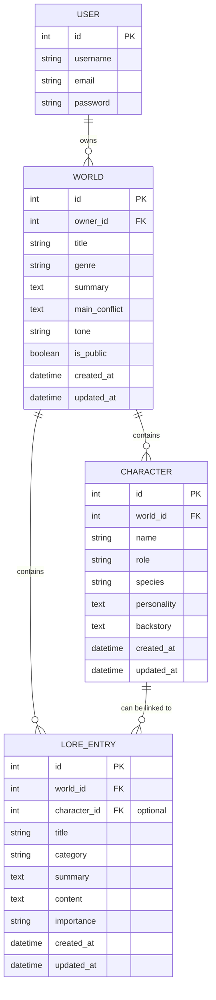

# Lorekeeper

## Live Site

Live site link will be added after deployment.

## Repository

Repository link will be added here.

## Project Overview

Lorekeeper is a full-stack worldbuilding web application designed for writers, roleplayers, tabletop game masters, and creative hobbyists.

The application allows users to create, organise, manage, and optionally share fictional worlds using structured records such as worlds, characters, lore entries, and locations.

## Purpose and Value

Lorekeeper helps users keep their worldbuilding notes in one organised place instead of relying on scattered documents, notebooks, or disconnected files.

## Target Audience

- Writers creating fictional settings
- Roleplayers organising characters and scenarios
- Tabletop game masters managing lightweight campaign notes
- Creative hobbyists who want a structured place for ideas

## User Stories

User stories are currently managed through GitHub Issues and the Lorekeeper Product Backlog project board.

A full list of user stories will be documented here as development progresses.

## Agile Methodology

This project uses GitHub Issues and a GitHub Project Board to manage the development process.

MoSCoW prioritisation is used to organise features into:

- Must Have
- Should Have
- Could Have
- Won't Have

Story points are used to estimate task size.

## Features

### Existing Features

- Initial Django project setup
- Worlds app created
- Local development server running

### Planned Features

- Homepage
- About page
- User registration
- User login and logout
- User dashboard
- World CRUD functionality
- Character CRUD functionality
- Lore entry CRUD functionality
- Public world library
- Search functionality

## Database Schema

Lorekeeper uses a relational database to store user-created worldbuilding content. The main models currently used in the project are:

* Django's built-in `User` model
* `World`
* `Character`
* `LoreEntry`

The structure is designed around the idea that a user can create fictional worlds, then add characters and lore entries to those worlds. Some lore entries can also be linked to a specific character, but this is optional because not all lore is character-related.

## Entity Relationship Diagram



## Model Relationships

### User to World

Django's built-in `User` model is used for account registration, login and ownership.

Each `World` belongs to one user through the `owner` foreign key.

```python
owner = models.ForeignKey(
    settings.AUTH_USER_MODEL,
    on_delete=models.CASCADE,
    related_name='worlds'
)
```

This means:

* One user can create many worlds.
* Each world has one owner.
* If a user is deleted, their worlds are also deleted.
* The `related_name='worlds'` allows the app to access all worlds created by a user.

This relationship is important because users should only be able to edit and delete their own worlds.

### World to Character

Each `Character` belongs to one `World`.

```python
world = models.ForeignKey(
    World,
    on_delete=models.CASCADE,
    related_name='characters'
)
```

This means:

* One world can have many characters.
* Each character belongs to one world.
* If a world is deleted, all characters linked to that world are also deleted.
* The `related_name='characters'` allows the app to access all characters connected to a world.

This suits the project because characters are part of a fictional setting and should not exist separately from the world they belong to.

### World to LoreEntry

Each `LoreEntry` belongs to one `World`.

```python
world = models.ForeignKey(
    World,
    on_delete=models.CASCADE,
    related_name='lore_entries'
)
```

This means:

* One world can have many lore entries.
* Each lore entry belongs to one world.
* If a world is deleted, all lore entries linked to that world are also deleted.
* The `related_name='lore_entries'` allows the app to access all lore entries connected to a world.

This works well for Lorekeeper because lore entries are used to store worldbuilding information such as history, culture, magic, technology, politics, species and timeline details.

### Character to LoreEntry

A `LoreEntry` can optionally be linked to a `Character`.

```python
character = models.ForeignKey(
    Character,
    on_delete=models.SET_NULL,
    related_name='lore_entries',
    blank=True,
    null=True
)
```

This means:

* A lore entry can be linked to a character.
* A lore entry does not have to be linked to a character.
* If a character is deleted, the lore entry is not deleted.
* Instead, the related character field is set to `NULL`.
* The lore entry still remains attached to its world.

This was done because some lore entries are character-specific, but others are general world lore. For example, a lore entry about a royal family could be linked to a character, while a lore entry about a magic system might not need a character link.

## Model Details

### World Model

The `World` model is the main record in the application. It stores the main information about a fictional world created by a user.

| Field           | Type                   | Purpose                                              |
| --------------- | ---------------------- | ---------------------------------------------------- |
| `owner`         | ForeignKey             | Links the world to the user who created it           |
| `title`         | CharField              | Stores the name of the world                         |
| `genre`         | CharField with choices | Stores the genre, such as fantasy, sci-fi or horror  |
| `summary`       | TextField              | Stores a short description of the world              |
| `main_conflict` | TextField              | Optional field for the central conflict or problem   |
| `tone`          | CharField              | Optional field for the mood or tone of the world     |
| `is_public`     | BooleanField           | Controls whether the world is public or private      |
| `created_at`    | DateTimeField          | Automatically stores when the world was created      |
| `updated_at`    | DateTimeField          | Automatically stores when the world was last updated |

The `World` model uses genre choices to keep the data more consistent. This helps avoid lots of different spellings or versions of the same genre.

The model is ordered by newest first:

```python
class Meta:
    ordering = ['-created_at']
```

### Character Model

The `Character` model stores characters connected to a world.

| Field         | Type          | Purpose                                                  |
| ------------- | ------------- | -------------------------------------------------------- |
| `world`       | ForeignKey    | Links the character to a world                           |
| `name`        | CharField     | Stores the character name                                |
| `role`        | CharField     | Optional role, such as hero, villain or ruler            |
| `species`     | CharField     | Optional species or character type                       |
| `personality` | TextField     | Optional personality details                             |
| `backstory`   | TextField     | Optional history or background                           |
| `created_at`  | DateTimeField | Automatically stores when the character was created      |
| `updated_at`  | DateTimeField | Automatically stores when the character was last updated |

The model is ordered alphabetically by character name:

```python
class Meta:
    ordering = ['name']
```

### LoreEntry Model

The `LoreEntry` model stores pieces of lore connected to a world. These can also be optionally linked to a character.

| Field        | Type                   | Purpose                                                   |
| ------------ | ---------------------- | --------------------------------------------------------- |
| `world`      | ForeignKey             | Links the lore entry to a world                           |
| `character`  | ForeignKey             | Optional link to a related character                      |
| `title`      | CharField              | Stores the title of the lore entry                        |
| `category`   | CharField with choices | Stores the lore category                                  |
| `summary`    | TextField              | Optional short summary                                    |
| `content`    | TextField              | Stores the full lore entry                                |
| `importance` | CharField with choices | Stores how important the lore entry is                    |
| `created_at` | DateTimeField          | Automatically stores when the lore entry was created      |
| `updated_at` | DateTimeField          | Automatically stores when the lore entry was last updated |

The category choices help keep lore organised into areas such as:

* History
* Culture
* Magic
* Technology
* Politics
* Religion
* Species
* Timeline
* Geography
* Miscellaneous

The importance choices allow the user to mark lore entries as low, medium, high or essential importance.

The model is ordered alphabetically by title:

```python
class Meta:
    ordering = ['title']
```

## Why This Schema Fits the Project

This schema fits Lorekeeper because the project is based on worldbuilding. The structure lets users create a world first, then attach characters and lore to that world. This keeps the data organised and makes it clear which records belong together.

The database also supports ownership and privacy. Worlds are linked to users, which means the application can check who owns each world before allowing edit or delete actions. The `is_public` field also allows users to choose whether a world should appear in the public world library or stay private.

The optional relationship between `LoreEntry` and `Character` gives the project more flexibility. Some lore is about the whole world, while some lore is connected to a specific character. Making this relationship optional means the user is not forced to choose a character when it does not make sense.

Overall, the schema supports the main purpose of the application by letting users create, organise, view, update and delete connected worldbuilding records.


## Technologies Used

- HTML
- CSS
- JavaScript
- Python
- Django
- SQLite for local development
- PostgreSQL
- Git
- GitHub
- Heroku for deployment

## Testing

Manual testing documentation will be added as features are developed.

Testing will cover:

- Navigation
- Authentication
- CRUD functionality
- Permissions
- Form validation
- Responsive design
- Deployment

## Deployment

Deployment steps will be documented once the application is deployed.

## Security

Security considerations will include:

- Secret keys stored securely
- Environment variables used for sensitive data
- DEBUG turned off in production
- User ownership checks
- Login required for protected actions
- CSRF protection on forms

## Bugs

Known bugs and fixes will be documented here during development.

## Future Features

- Image uploads
- AI generation
- Collaborative editing
- Private messaging
- Rich text editor

## Credits

Credits and external resources will be added here.

## Acknowledgements

This project was created as part of a Level 5 Diploma in Web Application Development.